# BTS CIEL 2 : Physique
## Recueil de cours

## Table des matières

- [BTS CIEL 2 : Physique](#bts-ciel-2--physique)
  - [Recueil de cours](#recueil-de-cours)
  - [Table des matières](#table-des-matières)
  - [0. Aide-mémoire : unités et équivalences](#0-aide-mémoire--unités-et-équivalences)
    - [Préfixes multiplicateurs (à connaître par cœur)](#préfixes-multiplicateurs-à-connaître-par-cœur)
    - [Grandeurs, symboles et unités SI utilisées dans ce dossier](#grandeurs-symboles-et-unités-si-utilisées-dans-ce-dossier)
    - [Conversions rapides fréquemment nécessaires](#conversions-rapides-fréquemment-nécessaires)
  - [Chapitre 1 : Électricité et optoélectronique](#chapitre-1--électricité-et-optoélectronique)
    - [1.1 Bases de l'électricité](#11-bases-de-lélectricité)
    - [1.2 Circuits linéaires en régime sinusoïdal (systèmes linéaires)](#12-circuits-linéaires-en-régime-sinusoïdal-systèmes-linéaires)
    - [1.3 Puissances, décibels, atténuation et gains](#13-puissances-décibels-atténuation-et-gains)
    - [1.4 Semi-conducteurs : la jonction PN et la diode](#14-semi-conducteurs--la-jonction-pn-et-la-diode)
    - [1.5 Bandes d'énergie et photons](#15-bandes-dénergie-et-photons)
      - [Les photons et l'échange d'énergie avec la matière](#les-photons-et-léchange-dénergie-avec-la-matière)
    - [1.6 La diode électroluminescente (DEL/LED)](#16-la-diode-électroluminescente-delled)
    - [1.7 La diode laser](#17-la-diode-laser)
    - [1.8 La photodiode](#18-la-photodiode)
    - [1.9 Le capteur CCD (Charge-Coupled Device)](#19-le-capteur-ccd-charge-coupled-device)
    - [Erreurs fréquentes des étudiants](#erreurs-fréquentes-des-étudiants)
  - [Chapitre 2 : Mesures et incertitudes](#chapitre-2--mesures-et-incertitudes)
    - [2.1 Notions fondamentales et incertitudes de mesure](#21-notions-fondamentales-et-incertitudes-de-mesure)
    - [2.2 Le bruit : une source d'incertitude sur tout signal mesuré](#22-le-bruit--une-source-dincertitude-sur-tout-signal-mesuré)
  - [Chapitre 3 : Ondes et propagation](#chapitre-3--ondes-et-propagation)
    - [3.1 Ondes mécaniques progressives](#31-ondes-mécaniques-progressives)
    - [3.2 Ondes progressives sinusoïdales](#32-ondes-progressives-sinusoïdales)
    - [3.3 Lecture d'une onde à l'oscilloscope et déphasage](#33-lecture-dune-onde-à-loscilloscope-et-déphasage)
    - [3.4 Ondes sonores et effet Doppler](#34-ondes-sonores-et-effet-doppler)
    - [3.5 Ondes électromagnétiques : propriétés](#35-ondes-électromagnétiques--propriétés)
    - [3.6 Classification du spectre électromagnétique](#36-classification-du-spectre-électromagnétique)
    - [3.7 Polarisation d'une onde électromagnétique](#37-polarisation-dune-onde-électromagnétique)
    - [3.8 Antennes, réflexion et réfraction en espace libre](#38-antennes-réflexion-et-réfraction-en-espace-libre)
    - [3.9 Liaison hertzienne](#39-liaison-hertzienne)
    - [3.10 Modélisation d'une ligne de transmission](#310-modélisation-dune-ligne-de-transmission)
    - [3.11 Propagation impulsionnelle et réflexions](#311-propagation-impulsionnelle-et-réflexions)
    - [3.12 Taux d'ondes stationnaires (TOS) et atténuation linéique](#312-taux-dondes-stationnaires-tos-et-atténuation-linéique)
    - [Erreurs fréquentes des étudiants](#erreurs-fréquentes-des-étudiants-1)
  - [Chapitre 4 : Systèmes bouclés et asservissement](#chapitre-4--systèmes-bouclés-et-asservissement)
    - [4.1 Boucle ouverte, boucle fermée : vocabulaire et principes](#41-boucle-ouverte-boucle-fermée--vocabulaire-et-principes)
    - [4.2 Modélisation d'un système linéaire](#42-modélisation-dun-système-linéaire)
    - [4.3 Les systèmes du premier ordre](#43-les-systèmes-du-premier-ordre)
    - [4.4 Les systèmes du second ordre](#44-les-systèmes-du-second-ordre)
    - [4.5 De l'équation différentielle à la transmittance (fonction de transfert)](#45-de-léquation-différentielle-à-la-transmittance-fonction-de-transfert)
    - [4.6 Réponse temporelle : la réponse à un échelon](#46-réponse-temporelle--la-réponse-à-un-échelon)
    - [4.7 Identifier la nature d'un système à partir de sa réponse à un échelon](#47-identifier-la-nature-dun-système-à-partir-de-sa-réponse-à-un-échelon)
    - [Erreurs fréquentes des étudiants](#erreurs-fréquentes-des-étudiants-2)
  - [Chapitre 5 : Traitement du signal](#chapitre-5--traitement-du-signal)
    - [5.1 Analyse temporelle des signaux](#51-analyse-temporelle-des-signaux)
    - [5.2 Analyse fréquentielle des signaux](#52-analyse-fréquentielle-des-signaux)
    - [5.3 Réponse fréquentielle : transmittance et diagramme de Bode](#53-réponse-fréquentielle--transmittance-et-diagramme-de-bode)
    - [5.4 Amplification](#54-amplification)
    - [5.5 Filtrage analogique](#55-filtrage-analogique)
    - [5.6 Numérisation des signaux analogiques et restitution](#56-numérisation-des-signaux-analogiques-et-restitution)
    - [Erreurs fréquentes des étudiants](#erreurs-fréquentes-des-étudiants-3)
  - [Chapitre 6 : Optique](#chapitre-6--optique)
    - [6.1 Indice de réfraction et propagation de la lumière](#61-indice-de-réfraction-et-propagation-de-la-lumière)
    - [6.2 Réflexion, réfraction et réflexion totale](#62-réflexion-réfraction-et-réflexion-totale)
    - [6.3 La fibre optique : structure et principe](#63-la-fibre-optique--structure-et-principe)
    - [6.4 Dispersion, bande passante et atténuation d'une fibre optique](#64-dispersion-bande-passante-et-atténuation-dune-fibre-optique)
    - [6.5 Le spectre optique : infrarouge, visible, ultraviolet](#65-le-spectre-optique--infrarouge-visible-ultraviolet)
    - [Erreurs fréquentes des étudiants](#erreurs-fréquentes-des-étudiants-4)
  - [Chapitre 7 : Préparation à l'épreuve](#chapitre-7--préparation-à-lépreuve)
  - [Bibliographie et ressources pour aller plus loin](#bibliographie-et-ressources-pour-aller-plus-loin)
    - [Références techniques par thème](#références-techniques-par-thème)
    - [Pour la culture scientifique et donner du sens (à recommander aux étudiants curieux)](#pour-la-culture-scientifique-et-donner-du-sens-à-recommander-aux-étudiants-curieux)
    - [Ressources numériques et normatives (gratuites)](#ressources-numériques-et-normatives-gratuites)
  - [Glossaire des formules](#glossaire-des-formules)
  - [Glossaire du vocabulaire technique](#glossaire-du-vocabulaire-technique)

---

## 0. Aide-mémoire : unités et équivalences

À distribuer ou projeter en permanence pendant la séance : beaucoup d'erreurs de calcul viennent d'une conversion d'unité oubliée (mA ↔ A, kΩ ↔ Ω, ms ↔ s…).

### Préfixes multiplicateurs (à connaître par cœur)

| Préfixe | Symbole | Facteur | Exemple d'usage |
|---|---|---|---|
| giga | G | ×10⁹ | GHz (fréquence radio) |
| méga | M | ×10⁶ | MΩ, MHz |
| kilo | k | ×10³ | kΩ, kHz |
| : | (unité) | ×10⁰ | V, A, Ω, s, Hz |
| déci | d | ×10⁻¹ | dB (échelle log, à part) |
| centi | c | ×10⁻² | cm |
| milli | m | ×10⁻³ | mV, mA, ms |
| micro | µ | ×10⁻⁶ | µV, µA, µF |
| nano | n | ×10⁻⁹ | ns, nF |
| pico | p | ×10⁻¹² | pF |

### Grandeurs, symboles et unités SI utilisées dans ce dossier

| Grandeur | Symbole | Unité SI | Symbole unité | Équivalences usuelles |
|---|---|---|---|---|
| Tension électrique | U, V | volt | V | 1 kV = 10³ V ; 1 mV = 10⁻³ V |
| Intensité du courant | I | ampère | A | 1 mA = 10⁻³ A ; 1 µA = 10⁻⁶ A |
| Résistance électrique | R | ohm | Ω | 1 kΩ = 10³ Ω ; 1 MΩ = 10⁶ Ω |
| Puissance | P | watt | W | 1 mW = 10⁻³ W ; 1 kW = 10³ W |
| Énergie | E, W | joule | J | 1 kWh = 3,6.10⁶ J |
| Temps, période | t, T | seconde | s | 1 ms = 10⁻³ s ; 1 µs = 10⁻⁶ s ; 1 ns = 10⁻⁹ s |
| Fréquence | f | hertz | Hz | 1 kHz = 10³ Hz ; 1 MHz = 10⁶ Hz ; 1 GHz = 10⁹ Hz |
| Longueur, longueur d'onde | l, λ | mètre | m | 1 cm = 10⁻² m ; 1 mm = 10⁻³ m |
| Vitesse, célérité | v, c | mètre par seconde | m/s | 1 km/h ≈ 0,278 m/s |
| Capacité électrique | C | farad | F | 1 µF = 10⁻⁶ F ; 1 nF = 10⁻⁹ F ; 1 pF = 10⁻¹² F |
| Charge électrique | Q | coulomb | C | : |
| Angle, déphasage | φ, θ | radian | rad | 2π rad = 360° ; 1 rad ≈ 57,3° |
| Température | θ, T | degré Celsius / kelvin | °C / K | T(K) = θ(°C) + 273,15 |
| Rapport de puissance (atténuation, gain) | A, G | décibel (sans dimension) | dB | A(dB) = 10·log₁₀(P_s/P_e) |

### Conversions rapides fréquemment nécessaires

| Conversion | Méthode | Exemple |
|---|---|---|
| mA → A | ÷ 1000 | 25 mA = 0,025 A |
| kΩ → Ω | × 1000 | 4,7 kΩ = 4700 Ω |
| ms → s | ÷ 1000 | 0,5 ms = 0,0005 s |
| kHz → Hz | × 1000 | 100 kHz = 100 000 Hz |
| nF → F | ÷ 10⁹ | 100 nF = 100.10⁻⁹ F |
| Fréquence ↔ période | f = 1/T ; T = 1/f | 1 kHz ↔ 1 ms |
| Puissance ↔ dB | A(dB) = 10·log₁₀(P₂/P₁) | ratio 2 ↔ ≈ 3 dB ; ratio 10 ↔ 10 dB |

---

## Chapitre 1 : Électricité et optoélectronique

### 1.1 Bases de l'électricité

**Grandeurs et conventions**

- Tension U (volt, V) : différence de potentiel entre deux points, toujours mesurée entre deux bornes (en parallèle sur le dipôle). Symbole du voltmètre : 
- Intensité I (ampère, A) : débit de charges électriques, mesurée en série dans le circuit. Symbole de l'ampèremètre : 
- Résistance R (ohm, Ω) : caractérise l'opposition d'un dipôle au passage du courant. Symbole (norme IEC) : 
- **Convention récepteur** (celle utilisée pour une résistance, une lampe, un moteur en fonctionnement normal) : U et I sont fléchés en sens opposés sur le dipôle. C'est la convention à utiliser presque systématiquement en TP sur des composants passifs.
- **Convention générateur** (pile, alimentation) : U et I sont fléchés dans le même sens. Symbole d'un générateur de tension continue :

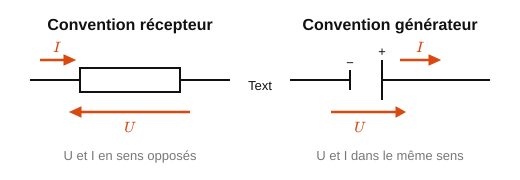

<em>Figure 1 : Convention récepteur vs convention générateur.</em>

**Loi d'Ohm**

Pour un conducteur ohmique (résistance) :

$$U = R \times I \tag{1}$$

*Exemple résolu :* une résistance R = 470 Ω est parcourue par I = 12 mA.
U = 470 × 0,012 = 5,64 V

**Puissance électrique**

P = U × I = R × I² = U² / R (en watt, W)

*Exemple résolu (suite) :* P = U × I = 5,64 × 0,012 ≈ 68 mW, ou P = R×I² = 470 × 0,012² ≈ 68 mW.

**Lois de Kirchhoff**

- **Loi des nœuds :** la somme des courants entrant dans un nœud est égale à la somme des courants sortants.
  Exemple : si I1 = 3 A et I2 = 2 A arrivent sur un nœud d'où repart I3, alors I3 = I1 + I2 = 5 A.

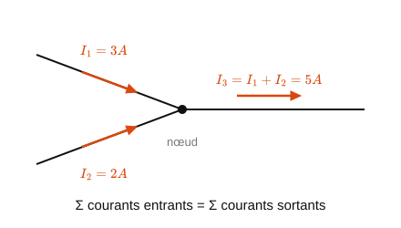

<em>Figure 2 : Loi des nœuds.</em>

- **Loi des mailles :** la somme algébrique des tensions le long d'une maille fermée est nulle (en respectant un sens de parcours et le signe de chaque tension selon son orientation).
  Exemple : un générateur E = 9 V alimente en série R1 et R2. En parcourant la maille : E − U(R1) − U(R2) = 0, donc U(R1) + U(R2) = E.

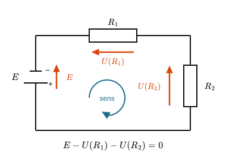

<em>Figure 3 : Loi des mailles.</em>

**Associations de résistances**

- Série : $R_{éq} = R_1 + R_2 + \dots + R_n$ (le courant est le même dans chaque résistance)
- Parallèle : $\dfrac{1}{R_{éq}} = \dfrac{1}{R_1} + \dfrac{1}{R_2} + \dots + \dfrac{1}{R_n}$ (la tension est la même aux bornes de chaque résistance)
- Cas particulier utile : deux résistances égales R en parallèle donnent R_éq = R/2.

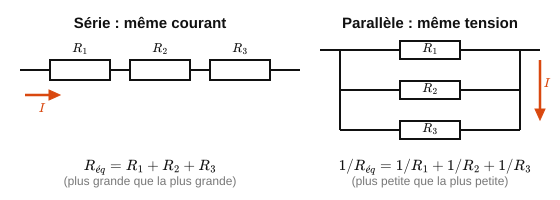

<em>Figure 4 : Associations de résistances (série/parallèle).</em>

**Diviseur de tension et diviseur de courant**

- Diviseur de tension (R1 en haut, R2 en bas, alimentation U) :

$$U(R_2) = U \times \dfrac{R_2}{R_1 + R_2} \tag{2}$$

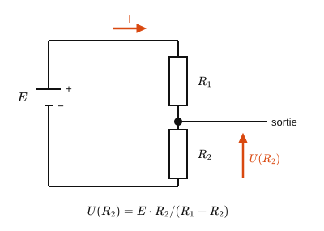

<em>Figure 5 a : Pont diviseur de tension.</em>

> **Démonstration.** R₁ et R₂ sont en série : elles sont traversées par le **même courant** I.
>
> D'après la loi des mailles, la tension d'alimentation se répartit entre les deux résistances : $U = U(R_1) + U(R_2)$.
>
> D'après la loi d'Ohm appliquée à chacune : $U(R_1) = R_1 I$ et $U(R_2) = R_2 I$, d'où $U = (R_1 + R_2)\,I$, soit $I = \dfrac{U}{R_1 + R_2}$.
>
> En réinjectant dans $U(R_2) = R_2 I$ : $U(R_2) = U \times \dfrac{R_2}{R_1 + R_2}$. ∎
>
> *Remarque : la tension se répartit proportionnellement aux résistances, la plus grande résistance recevant la plus grande part de la tension.*

- Diviseur de courant (R1 et R2 en parallèle, courant total I) : $I(R_2) = I \times \dfrac{R_1}{R_1 + R_2}$ (le courant se répartit à l'inverse des résistances : plus une branche est résistante, moins elle reçoit de courant)

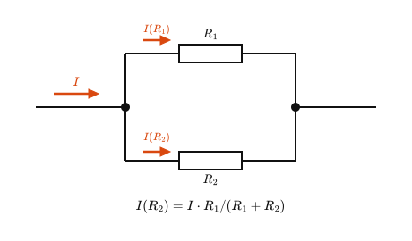

<em>Figure 5 b : Pont diviseur de courant.</em>

> **Démonstration.** R₁ et R₂ sont en parallèle : elles sont soumises à la **même tension** U.
>
> D'après la loi des nœuds, le courant total se partage entre les deux branches : $I = I_1 + I_2$.
>
> D'après la loi d'Ohm : $U = R_1 I_1 = R_2 I_2$. La résistance équivalente des deux branches vaut $R_{éq} = \dfrac{R_1 R_2}{R_1 + R_2}$, donc $U = R_{éq}\,I = I \times \dfrac{R_1 R_2}{R_1 + R_2}$.
>
> En réinjectant dans $I_2 = \dfrac{U}{R_2}$ : $I(R_2) = I \times \dfrac{R_1}{R_1 + R_2}$. ∎
>
> *Remarque : c'est bien R₁ (la résistance de l'**autre** branche) qui apparaît au numérateur : le courant privilégie la branche la moins résistante.*

**Court-circuit et circuit ouvert**

- Court-circuit : U = 0 quelle que soit l'intensité (résistance nulle) : attention, danger en pratique si non protégé.
- Circuit ouvert : I = 0 quelle que soit la tension (résistance infinie).

**Erreurs fréquentes des étudiants**

- Confondre mesure en série (ampèremètre) et mesure en parallèle (voltmètre).
- Oublier qu'en série c'est le courant qui est commun, en parallèle c'est la tension.
- Mélanger résistance équivalente série (toujours plus grande que la plus grande des résistances) et parallèle (toujours plus petite que la plus petite).
- Appliquer la loi d'Ohm sur un générateur ou une diode (non ohmiques).

> → **Application concrète :** **Le capteur de courant d'une alimentation d'ordinateur (shunt).** Pour mesurer le courant consommé par un processeur ou une carte, on intercale en série une résistance de très faible valeur (le *shunt*, quelques milliohms) et on mesure la tension à ses bornes : d'après la loi d'Ohm, $I = U/R$. Les cartes mères, les chargeurs USB-C et les alimentations de serveurs utilisent ce principe pour surveiller la consommation et couper en cas de surintensité. Le pont diviseur de tension, lui, sert partout où un microcontrôleur (3,3 V) doit lire une tension plus élevée sans être détruit.

---

### 1.2 Circuits linéaires en régime sinusoïdal (systèmes linéaires)

**Notation complexe**

En régime sinusoïdal établi, on associe à tout signal s(t) = S√2·sin(2πft+φ) un nombre complexe $\underline{S} = S \, e^{j\varphi}$, dont le module est la valeur efficace et l'argument la phase à l'origine. En notation complexe, dériver par rapport au temps revient à multiplier par jω.

**Impédance et admittance complexes**

Pour un dipôle traversé par i(t) et soumis à u(t), on définit par analogie avec la loi d'Ohm : $\underline{U} = \underline{Z} \cdot \underline{I}$, où $\underline{Z} = \dfrac{\underline{U}}{\underline{I}}$ est l'impédance complexe (en Ω). L'**admittance** est son inverse : $\underline{Y} = \dfrac{1}{\underline{Z}}$ (en siemens, S).

**Associations de dipôles**

- Impédances en série : $\underline{Z}_{éq} = \underline{Z}_1 + \underline{Z}_2 + \dots + \underline{Z}_n$ (généralise le cas des résistances).
- Admittances en parallèle : $\underline{Y}_{éq} = \underline{Y}_1 + \underline{Y}_2 + \dots + \underline{Y}_n$. Pour deux dipôles en parallèle : $\underline{Z}_{éq} = \dfrac{\underline{Z}_1 \underline{Z}_2}{\underline{Z}_1 + \underline{Z}_2}$.

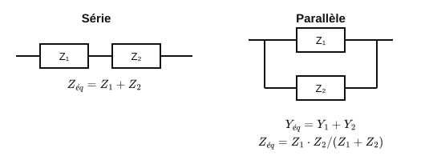

<em>Figure 7 : Association d'impédances (série/parallèle).</em>

**Le dipôle RLC série : impédance et résonance**

Un dipôle RLC série associe une résistance R, une bobine d'inductance L et un condensateur de capacité C, traversés par le même courant. Les impédances complexes élémentaires sont :

- Résistance : $\underline{Z}_R = R$ (réelle, pas de déphasage).
- Bobine : $\underline{Z}_L = jL\omega$ (la tension est en avance de 90° sur le courant).
- Condensateur : $\underline{Z}_C = \dfrac{1}{jC\omega} = -\dfrac{j}{C\omega}$ (la tension est en retard de 90° sur le courant).

En série, les impédances s'ajoutent :

$$\underline{Z} = R + j\left(L\omega - \dfrac{1}{C\omega}\right)$$

Le module de l'impédance vaut donc $|\underline{Z}| = \sqrt{R^2 + \left(L\omega - \dfrac{1}{C\omega}\right)^2}$. On observe trois régimes selon la fréquence :

| Fréquence | Terme dominant | Comportement du dipôle |
|---|---|---|
| Basse fréquence (ω petit) | $\dfrac{1}{C\omega}$ grand | Comportement **capacitif** : l'impédance est élevée, le courant est en avance sur la tension |
| Fréquence de résonance ω₀ | $L\omega_0 = \dfrac{1}{C\omega_0}$ | Comportement **purement résistif** : $\underline{Z} = R$, impédance **minimale**, courant **maximal**, tension et courant en phase |
| Haute fréquence (ω grand) | $L\omega$ grand | Comportement **inductif** : l'impédance est élevée, le courant est en retard sur la tension |

**Résonance d'un dipôle RLC**

La résonance se produit lorsque les effets de la bobine et du condensateur se compensent exactement ($L\omega_0 = 1/(C\omega_0)$, soit $LC\omega_0^2 = 1$), ce qui donne la **fréquence de résonance** :

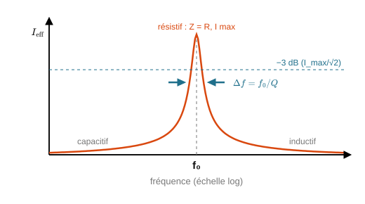

<em>Figure 6 : Diagramme de Bode d'un circuit RLC (résonance).</em>

$$f_0 = \dfrac{1}{2\pi\sqrt{LC}} \tag{3}$$

> **Démonstration.** Le dipôle est purement résistif lorsque la partie imaginaire de $\underline{Z}$ s'annule : $L\omega_0 - \dfrac{1}{C\omega_0} = 0$, soit $L\omega_0 = \dfrac{1}{C\omega_0}$, donc $\omega_0^2 = \dfrac{1}{LC}$ et $\omega_0 = \dfrac{1}{\sqrt{LC}}$. Comme $\omega_0 = 2\pi f_0$, on obtient $f_0 = \dfrac{1}{2\pi\sqrt{LC}}$. ∎

À cette fréquence, l'intensité efficace dans un RLC série (alimenté en tension) est maximale ; la tension efficace aux bornes d'un RLC parallèle (alimenté en courant) est maximale.

**Facteur de qualité et sélectivité**

La "finesse" de la résonance se caractérise par le **facteur de qualité** :

$$Q = \dfrac{L\omega_0}{R} = \dfrac{1}{RC\omega_0} = \dfrac{1}{R}\sqrt{\dfrac{L}{C}}$$

- Un Q élevé (R faible) donne une résonance **étroite et prononcée** : le dipôle ne "répond" fortement que dans une bande de fréquences très resserrée autour de f₀. On parle de dipôle **sélectif**.
- Un Q faible (R élevée) donne une résonance **large et amortie**.
- La **bande passante à −3 dB** est reliée à Q par : $\Delta f = \dfrac{f_0}{Q}$.

*Exemple résolu :* L = 10 mH, C = 100 nF, R = 20 Ω.
$f_0 = \dfrac{1}{2\pi\sqrt{10^{-2} \times 10^{-7}}} = \dfrac{1}{2\pi\sqrt{10^{-9}}} \approx \dfrac{1}{2\pi \times 3{,}16 \times 10^{-5}} \approx 5{,}03$ kHz.
$Q = \dfrac{1}{R}\sqrt{\dfrac{L}{C}} = \dfrac{1}{20}\sqrt{\dfrac{10^{-2}}{10^{-7}}} = \dfrac{1}{20} \times 316 \approx 15{,}8$.
$\Delta f = \dfrac{f_0}{Q} \approx \dfrac{5030}{15{,}8} \approx 318$ Hz : le dipôle est sélectif, il ne laisse passer efficacement qu'une bande d'environ 300 Hz autour de 5 kHz.

**Surtension à la résonance**

À la résonance, la tension aux bornes de L (ou de C) peut être **beaucoup plus grande** que la tension d'alimentation : $U_L = U_C = Q \times U$. Avec Q = 15,8 dans l'exemple précédent, une alimentation de 1 V produit près de 16 V aux bornes du condensateur : d'où le nom de **surtension**, et la nécessité de choisir des composants dont la tenue en tension est suffisante.

**Le dipôle RLC parallèle (anti-résonance)**

Lorsque R, L et C sont en parallèle (soumis à la même tension), le raisonnement se fait sur les admittances, qui s'ajoutent : $\underline{Y} = \dfrac{1}{R} + j\left(C\omega - \dfrac{1}{L\omega}\right)$. La fréquence de résonance est la **même** ($f_0 = 1/(2\pi\sqrt{LC})$), mais le comportement est inversé : à f₀, l'admittance est **minimale**, donc l'impédance est **maximale** et le dipôle absorbe un courant minimal. On parle parfois d'**anti-résonance** (ou circuit bouchon), utilisée pour bloquer une fréquence précise.

> → **Application concrète :** **Le circuit d'accord d'un récepteur radio ou d'une carte RFID/NFC.** Un lecteur NFC (badge d'accès, paiement sans contact, comme dans l'annale 2026) utilise une antenne en boucle (inductance L) associée à un condensateur C, réglés pour résonner exactement à 13,56 MHz. Grâce à un facteur de qualité élevé, l'antenne ne "voit" que cette fréquence et rejette les autres : c'est ce qui permet au lecteur de capter un signal très faible venant d'un badge passif, tout en ignorant le bruit électromagnétique ambiant. Le même principe sert à sélectionner une station FM ou un canal Wi-Fi dans un étage radiofréquence.

**Théorèmes utiles**

- Les lois des nœuds et des mailles s'appliquent sans restriction en notation complexe (comme en continu).
- **Théorème de superposition :** la réponse d'un réseau linéaire contenant plusieurs sources indépendantes est la somme des réponses dues à chaque source agissant seule (les autres étant éteintes).

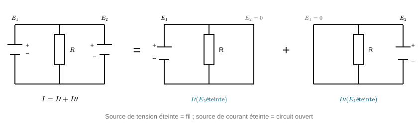

<em>Figure 8 : Théorème de superposition.</em>

- **Théorèmes de Thévenin et de Norton :** tout dipôle actif linéaire peut être remplacé par un générateur de tension équivalent en série avec une résistance (modèle de Thévenin), ou par un générateur de courant équivalent en parallèle avec une résistance (modèle de Norton) : les deux modèles étant équivalents entre eux.

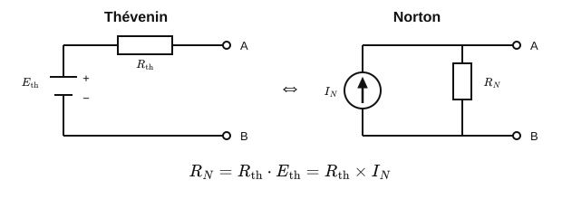

<em>Figure 9 : Modèle de Thévenin et de Norton.</em>

---

### 1.3 Puissances, décibels, atténuation et gains

**Rappel : puissance en régime sinusoïdal**

- Un signal sinusoïdal s'écrit u(t) = U_max·sin(ωt). Sa valeur efficace (RMS) est :

$$U_{eff} = \dfrac{U_{max}}{\sqrt{2}} \approx 0{,}707 \times U_{max} \tag{4}$$

- Puissance moyenne dissipée dans une résistance R :

$$P = \dfrac{U_{eff}^2}{R} = R \times I_{eff}^2 = U_{eff} \times I_{eff} \tag{5}$$

*Exemple résolu :* un signal sinusoïdal d'amplitude U_max = 5 V attaque une résistance R = 50 Ω.
U_eff = 5/√2 ≈ 3,54 V. P = U_eff²/R = 3,54²/50 ≈ 0,25 W.

**Gain et atténuation en linéaire**

- Gain en puissance : $G = \dfrac{P_s}{P_e}$ (sans unité ; G > 1 = amplification, G < 1 = atténuation).
- Gain en tension (mêmes impédances d'entrée et de sortie) :

$$A_v = \dfrac{V_s}{V_e} \tag{6}$$

**Le décibel (dB) : pourquoi et comment**

Le décibel est une échelle logarithmique, utilisée en électronique et en télécoms pour deux raisons : elle permet de manipuler des rapports qui varient sur plusieurs ordres de grandeur (ex. puissance très faible reçue par une antenne), et elle transforme les produits de gains successifs (cascade de quadripôles) en simples additions.

- Définition en puissance :

$$A_{(dB)} = 10 \times \log_{10}\!\left(\dfrac{P_2}{P_1}\right) \tag{7}$$

- Définition en tension, à impédances égales : $A_{(dB)} = 20 \times \log_{10}\!\left(\dfrac{U_2}{U_1}\right)$ (le facteur 20 vient de P ∝ U², donc log(U²) = 2log(U))
- Un gain positif correspond à une amplification ; un gain négatif correspond à une perte, que l'on appelle alors une **atténuation** (parfois notée positivement en valeur absolue : "atténuation de 6 dB" = gain de −6 dB).

**Valeurs remarquables à connaître par cœur**

| Rapport de puissance | En dB |
|---|---|
| ×1 (inchangé) | 0 dB |
| ×2 | +3 dB |
| ÷2 | −3 dB |
| ×10 | +10 dB |
| ÷10 | −10 dB |
| ×100 | +20 dB |
| ÷100 | −20 dB |
| ×1000 | +30 dB |

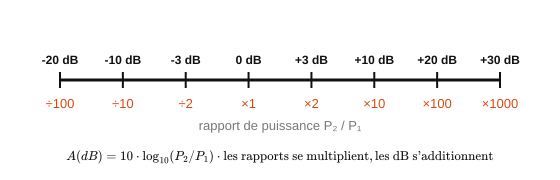

<em>Figure 10 : Échelle des décibels.</em>

*Exemple résolu :* P_e = 2,0 mW, P_s = 0,5 mW. A = 10×log₁₀(0,5/2,0) = 10×log₁₀(0,25) ≈ −6,02 dB (cohérent avec ÷4 ≈ deux fois ÷2, soit environ −3 −3 = −6 dB).

**Cascade de quadripôles (chaîne de transmission)**

Propriété clé du dB : en cascade, les gains et pertes **s'additionnent** en dB (alors qu'il faudrait les multiplier en linéaire) :

$$G_{total(dB)} = G_{1(dB)} + G_{2(dB)} + \dots + G_{n(dB)} \tag{8}$$

*Exemple résolu :* un amplificateur de +12 dB, suivi d'un câble de −4 dB, suivi d'un connecteur de −0,5 dB.
G_total = 12 − 4 − 0,5 = **+7,5 dB**.

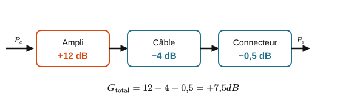

<em>Figure 11 : Chaîne de transmission en cascade.</em>

**Le dBm : une unité absolue de puissance**

Le dB seul exprime un **rapport** (sans dimension) entre deux puissances. Le **dBm** exprime au contraire une puissance **absolue**, rapportée à une référence de 1 mW :

$$P_{(dBm)} = 10 \times \log_{10}\!\left(\dfrac{P}{1\ \text{mW}}\right) \tag{9}$$

Valeurs repères à connaître : 0 dBm = 1 mW ; +10 dBm = 10 mW ; +20 dBm = 100 mW ; −10 dBm = 0,1 mW ; −30 dBm = 1 µW.

*Usage typique CIEL :* le dBm est la norme pour exprimer un niveau de signal Wi-Fi, un niveau reçu en fibre optique, ou la puissance d'émission d'un module radio.

**Bilan de liaison (budget de liaison)**

Comme les gains et pertes s'additionnent en dB, on peut ajouter directement des dB à une puissance en dBm pour suivre un signal tout au long d'une chaîne de transmission :

$$P_{s(dBm)} = P_{e(dBm)} + \sum \text{gains}_{(dB)} - \sum \text{pertes}_{(dB)} \tag{10}$$

*Exemple résolu :* un émetteur Wi-Fi sort à +20 dBm. Le signal traverse un câble (−2 dB), une antenne avec un gain de +5 dB, puis un trajet en espace libre qui atténue de 60 dB.
P_reçue = 20 − 2 + 5 − 60 = **−37 dBm** (soit environ 2.10⁻⁴ mW, un niveau de réception Wi-Fi tout à fait réaliste).

**D'autres échelles en dB, à connaître**

- **dBV** (décibel par rapport au volt) : $V_{dBV} = 20 \times \log_{10}\!\left(\dfrac{V_{eff}}{1\ \text{V}}\right)$. Un signal de 0 dBV a une amplitude efficace de 1 V.
- **dBµV** (décibel par rapport au microvolt) : même principe, référencé à 1 µV : pratique pour les signaux radiofréquence très faibles.
- Lien entre puissance et tension à impédance connue (utile en RF, où Z est normalisée à 50 Ω ou 75 Ω) :

$$P = \dfrac{U_{eff}^2}{Z} \tag{11}$$

**Erreurs fréquentes des étudiants**

- Confondre le facteur 10 (pour les puissances) et le facteur 20 (pour les tensions) dans la formule du dB.
- Traiter le dB comme une unité absolue de puissance, alors que c'est un rapport sans dimension : seul le **dBm** est absolu.
- Additionner directement deux niveaux exprimés en dBm comme s'il s'agissait de puissances linéaires (il faut repasser en mW pour sommer des puissances) : en revanche, on additionne bien un gain en dB à une puissance en dBm.

> → **Application concrète :** **Le niveau de réception Wi-Fi affiché par un ordinateur (RSSI).** La "force du signal" que rapporte une carte Wi-Fi est un niveau en dBm (typiquement de −30 dBm, excellent, à −90 dBm, inutilisable). Un administrateur réseau utilise ces valeurs, ainsi que les gains d'antenne en dBi et les pertes de câble en dB, pour dimensionner la couverture d'un bâtiment : c'est un bilan de liaison appliqué au quotidien. Le même calcul en dB sert à qualifier une liaison fibre optique (budget optique) avant sa mise en service.

---

### 1.4 Semi-conducteurs : la jonction PN et la diode

**La jonction PN**

- Un semi-conducteur dopé N présente un excès d'électrons libres ; un semi-conducteur dopé P présente un déficit d'électrons (des "trous"). Au contact des deux, une jonction PN se forme, avec une zone de déplétion qui bloque naturellement le passage du courant dans un sens.
- **Sens passant :** le courant circule facilement au-delà d'une tension de seuil.
- **Sens bloqué :** le courant reste quasi nul (hors courant de fuite négligeable), quelle que soit la tension appliquée (dans la limite de la tenue en tension inverse du composant).

**La diode et sa caractéristique**

- Tension de seuil typique pour le silicium : 0,6 à 0,7 V (le germanium, moins utilisé aujourd'hui, serait plutôt autour de 0,2-0,3 V).
- Caractéristique I(V) fortement non linéaire : croissance quasi exponentielle du courant au-delà du seuil, courant quasi nul en dessous et en sens bloqué.

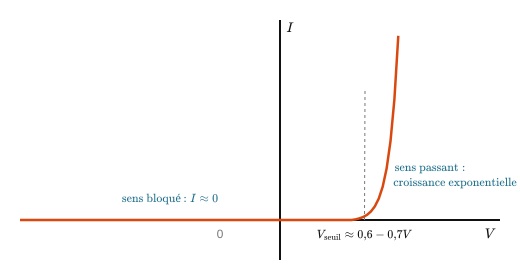

<em>Figure 12 : Caractéristique I(V) d'une diode.</em>

- **Modèle simplifié "diode idéale + seuil"**, très utile pour les calculs de première approche : en sens passant, on approxime V_diode ≈ 0,6-0,7 V quel que soit le courant ; en sens bloqué, I ≈ 0.

*Exemple résolu :* une diode silicium est montée en série avec une résistance de protection R = 1 kΩ sous une alimentation E = 5 V.
Avec le modèle simplifié : V_diode ≈ 0,7 V, donc U_R = E − V_diode = 5 − 0,7 = 4,3 V, et I = U_R/R = 4,3/1000 = 4,3 mA.

**Applications courantes**

- **Redressement :** transformer un signal alternatif en signal unidirectionnel (une diode simple pour le redressement simple alternance, un pont de 4 diodes pour le redressement double alternance).
- **Protection :** diode "de roue libre" en parallèle d'une bobine (relais, moteur) pour absorber la surtension à la coupure.
- **Indication/signalisation :** la LED, une diode électroluminescente, sera étudiée plus en détail dans la partie composants optoélectroniques.

**Erreurs fréquentes des étudiants**

- Appliquer la loi d'Ohm (U = R×I) directement sur une diode : elle n'est pas un composant linéaire, cette loi ne s'applique pas.
- Oublier la résistance de protection en série, ce qui peut détruire la diode (courant non limité).
- Se tromper de sens de montage : une diode montée à l'envers reste bloquée et ne laisse rien passer.

> → **Application concrète :** **La protection des ports d'entrée d'une carte électronique.** Les entrées d'un microcontrôleur ou d'une carte réseau sont protégées par des diodes dites "d'écrêtage" (ou TVS) : normalement bloquées, elles deviennent passantes dès que la tension dépasse un seuil, et détournent ainsi vers la masse les surtensions (décharge électrostatique, parasite sur un câble Ethernet) qui détruiraient le circuit. C'est aussi la fonction de la diode de roue libre qui protège un transistor commandant un relais (cf. TP mémoire).

---

### 1.5 Bandes d'énergie et photons

- Dans un cristal semi-conducteur (silicium, germanium), les niveaux d'énergie possibles pour les électrons se regroupent en bandes.
  - La **bande de valence** : les électrons y sont liés aux atomes et ne participent pas à la conduction.
  - La **bande de conduction** : les électrons y sont libres et peuvent se déplacer sous l'effet d'un champ électrique.
- On appelle **gap** (ou bande interdite) l'écart d'énergie ΔE entre ces deux bandes. Il dépend du matériau : pour le silicium, ΔE ≈ 1,1 eV.

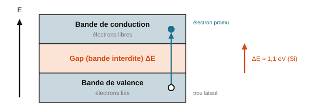

<em>Figure 13 : Bandes d'énergie dans un semi-conducteur.</em>

- Un semi-conducteur dopé N a un excès d'électrons libres ; un semi-conducteur dopé P a un déficit d'électrons (des « trous », qui se comportent comme des charges positives mobiles). La jonction PN est le contact entre les deux.

#### Les photons et l'échange d'énergie avec la matière

- La lumière visible, l'infrarouge, l'ultraviolet, les rayons X et gamma sont des ondes électromagnétiques caractérisées par leur fréquence ν. On peut aussi les décrire comme un flux de corpuscules appelés **photons**, chacun transportant une énergie :

$$E = h\nu = \dfrac{h c_0}{\lambda} \tag{12}$$

  avec h la constante de Planck (h ≈ 6,63×10⁻³⁴ J·s), c₀ la célérité de la lumière dans le vide et λ la longueur d'onde. On exprime souvent E en électronvolt (1 eV = 1,6×10⁻¹⁹ J).

- Les niveaux d'énergie d'un atome (E₁, E₂, E₃...) sont quantifiés : ils ne prennent que des valeurs précises, caractéristiques de l'atome.
- Un atome peut passer d'un niveau fondamental E₁ à un niveau excité E₂ en **absorbant** un photon d'énergie hν = E₂ − E₁. Inversement, il peut revenir de E₂ à E₁ en **émettant** un photon de cette même énergie. C'est ce second mécanisme qui est à l'œuvre dans une LED ou un laser.

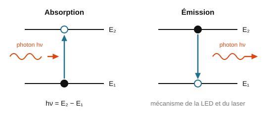

<em>Figure 14 : Absorption/émission d'un photon par un atome.</em>

*Exemple résolu :* quelle est l'énergie d'un photon de longueur d'onde λ = 650 nm (rouge) ?
E = hc₀/λ = (6,63×10⁻³⁴ × 3,0×10⁸) / (650×10⁻⁹) ≈ 3,06×10⁻¹⁹ J ≈ 1,91 eV.

> → **Application concrète :** **Le capteur d'image d'un smartphone ou d'une webcam.** Chaque pixel d'un capteur CMOS convertit les photons reçus en charges électriques, exactement selon le mécanisme d'absorption d'un photon par un semi-conducteur (le photon fournit l'énergie ΔE nécessaire pour faire passer un électron dans la bande de conduction). La sensibilité du capteur dans le visible, et son insensibilité aux ondes radio, s'expliquent directement par la relation $E = h\nu$ : seuls les photons suffisamment énergétiques peuvent franchir le gap du silicium.

### 1.6 La diode électroluminescente (DEL/LED)

- Une DEL est une diode qui émet de la lumière lorsqu'elle est polarisée en direct (anode +, cathode −) et parcourue par un courant.
- Les électrons qui traversent la jonction se recombinent avec des trous : ils passent de la bande de conduction à la bande de valence et libèrent leur énergie sous forme de photons.

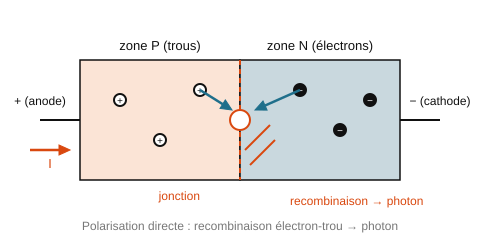

<em>Figure 15 : Structure d'une LED et recombinaison électron-trou.</em>

- La longueur d'onde émise est directement liée à la largeur du gap ΔE du matériau utilisé :

$$\nu = \dfrac{c_0}{\lambda} = \dfrac{\Delta E}{h} \tag{13}$$

  Un gap plus grand donne une lumière plus énergétique (donc plus proche du bleu/UV) ; un gap plus petit donne une lumière moins énergétique (plus proche du rouge/IR). C'est pourquoi on choisit un matériau semi-conducteur différent selon la couleur de LED souhaitée.

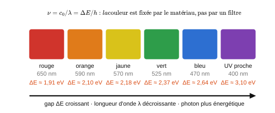

<em>Figure 16 : Relation gap / couleur émise.</em>

*Exemple résolu :* une LED rouge émet à λ ≈ 650 nm. Le gap du matériau utilisé vaut donc ΔE = hc₀/λ ≈ 1,91 eV (calcul identique à l'exemple précédent, puisque ΔE = E du photon émis).

> → **Application concrète :** **Les voyants d'état et les liaisons optiques d'un équipement réseau.** Les LED de face avant d'un switch (lien actif, activité, vitesse) sont des DEL de couleurs différentes obtenues avec des matériaux à gap différent. Plus important encore : les modules SFP des liaisons courtes (jusqu'à quelques centaines de mètres) utilisent une LED infrarouge à 850 nm comme émetteur, dont la longueur d'onde est fixée par le gap du semi-conducteur utilisé.

### 1.7 La diode laser

- Une diode laser est une diode dont la région active forme une cavité résonnante. Le courant injecté maintient la majorité des atomes dans un état excité.
- Chaque photon interagissant avec un atome excité provoque l'émission d'un second photon **identique** (même énergie, même phase) : c'est l'émission stimulée, à l'origine du terme LASER (*Light Amplification by Stimulated Emission of Radiation*).

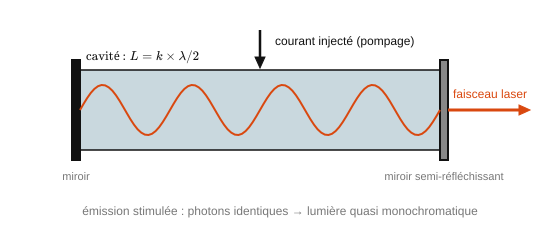

<em>Figure 17 : Cavité résonnante d'une diode laser.</em>

- La longueur de la cavité est un multiple de λ/2, ce qui sélectionne précisément la longueur d'onde émise.
- Par rapport à une LED classique, une diode laser délivre une puissance lumineuse plus importante et un rayonnement quasi monochromatique (une seule longueur d'onde bien définie) : c'est ce qui la rend indispensable pour les transmissions par fibre optique longue distance.

> → **Application concrète :** **Le module SFP d'une liaison fibre longue distance.** Pour transmettre sur plusieurs kilomètres (liaison entre deux sites d'une entreprise, épine dorsale d'un réseau opérateur), une LED ne suffit plus : le module émetteur utilise une diode laser à 1310 ou 1550 nm, quasi monochromatique, ce qui limite la dispersion chromatique dans la fibre et permet des débits de 10 Gbit/s et au-delà. Les lecteurs de codes-barres et les souris optiques laser reposent sur le même composant.

### 1.8 La photodiode

- Une photodiode convertit l'énergie lumineuse reçue en énergie électrique. Les photons absorbés créent des paires électron-trou, qui produisent un courant inverse (i < 0).
- **Mode photoconducteur :** la diode est polarisée en inverse par une tension continue. Le courant inverse ne dépend pas de la tension appliquée : il est proportionnel au flux lumineux reçu. C'est le mode utilisé pour un capteur de lumière ou un récepteur de liaison optique.
- **Mode photovoltaïque :** la diode n'est pas polarisée. Éclairée, elle se comporte comme un générateur : c'est le principe d'une cellule photovoltaïque.

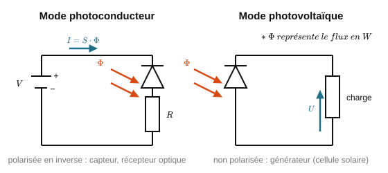

<em>Figure 18 : Photodiode : mode photoconducteur vs photovoltaïque.</em>

> → **Application concrète :** **Le récepteur d'une liaison fibre optique et les capteurs de présence.** À l'autre bout d'une liaison fibre, une photodiode (en mode photoconducteur) convertit les impulsions lumineuses en impulsions électriques, à des cadences de plusieurs milliards par seconde. Le même composant, associé à une LED infrarouge, forme les barrières optiques (détection d'un objet interrompant le faisceau) et les capteurs de proximité d'un smartphone qui éteignent l'écran pendant un appel.

### 1.9 Le capteur CCD (Charge-Coupled Device)

- Un capteur CCD est une matrice de photodiodes, chacune correspondant à un pixel de l'image.
- Lorsque le capteur est exposé à la lumière, chaque photodiode accumule une charge électrique proportionnelle au flux lumineux reçu.
- Les charges sont transférées ligne par ligne vers un registre, qui les envoie successivement à un convertisseur analogique-numérique (CAN) pour reconstituer l'image numérique.

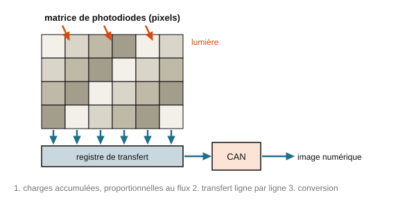

<em>Figure 19 : Principe d'un capteur CCD.</em>

> → **Application concrète :** **Les scanners de documents et les caméras de vidéosurveillance IP.** Un scanner à plat utilise une barrette CCD linéaire déplacée le long du document ; une caméra IP utilise une matrice CCD ou CMOS suivie d'un CAN, puis d'un compresseur vidéo qui envoie le flux sur le réseau. Toute la chaîne (capteur optique → conversion analogique-numérique → réseau) mobilise successivement les Chapitres 1, 5 et 3 de ce recueil.

### Erreurs fréquentes des étudiants

- Confondre le sens de polarisation d'une LED (elle n'émet qu'en direct) avec celui d'une photodiode utilisée en capteur (généralement polarisée en inverse).
- Croire qu'une diode laser et une LED fonctionnent sur des principes totalement différents : les deux reposent sur la recombinaison électron-trou dans une jonction PN ; seule l'émission stimulée (cavité résonnante) distingue le laser.
- Oublier que la couleur émise par une LED dépend du matériau (donc du gap), pas d'un filtre coloré appliqué après coup.

---

## Chapitre 2 : Mesures et incertitudes

### 2.1 Notions fondamentales et incertitudes de mesure

**Vocabulaire de base**

- *Mesurande* : la grandeur que l'on cherche à mesurer.
- *Justesse* : capacité d'un appareil à donner une valeur proche de la valeur vraie, en moyenne (absence d'erreur systématique).
- *Fidélité* : capacité à donner des valeurs proches les unes des autres lors de mesures répétées (dispersion faible).

<em>Figure 20 : Justesse vs fidélité.</em>

- *Exactitude* = justesse + fidélité.
- *Erreur systématique* : biais reproductible (ex. mauvais étalonnage, offset) : ne se réduit pas en répétant les mesures.
- *Erreur aléatoire* : fluctuation imprévisible d'une mesure à l'autre : se réduit statistiquement en répétant les mesures.

<em>Figure 21 : Erreur systématique vs erreur aléatoire.</em>

**Pourquoi une incertitude ?**

Toute mesure est entachée d'un doute : on ne connaît jamais la valeur vraie d'une grandeur, seulement une estimation encadrée par une incertitude qui exprime ce doute de façon quantifiée.

**Incertitude-type de type A (statistique)**

À partir d'une série de n mesures répétées x1, x2, …, xn :

- Valeur moyenne : x̄ = (Σxᵢ) / n
- Écart-type de la série : s = √[ Σ(xᵢ − x̄)² / (n−1) ]
- Incertitude-type de type A :

$$u_A = \dfrac{s}{\sqrt{n}} \tag{14}$$

*Exemple résolu :* 5 mesures d'une résistance donnent 220, 218, 221, 219, 222 Ω.
x̄ = 220 Ω. s ≈ 1,58 Ω. u_A = 1,58/√5 ≈ 0,71 Ω.

<em>Figure 23 : Distribution des mesures répétées (histogramme).</em>

**Incertitude-type de type B (non statistique)**

- Pour un appareil numérique de résolution (dernier digit) δ : **u_B ≈ δ / √12** (on suppose une loi de probabilité uniforme sur l'intervalle de résolution).
- Pour un appareil analogique de classe c et de calibre C : u_B ≈ (c × C) / (100 × √3).
- Pour une valeur donnée avec une tolérance constructeur ±a (ex. résistance à 5 %) : u_B ≈ a / √3.

*Exemple résolu :* multimètre numérique, résolution 0,01 V ⇒ u_B = 0,01/√12 ≈ 0,0029 V.

**Composer deux incertitudes**

Deux sources d'incertitude indépendantes se composent quadratiquement (pas en les additionnant simplement) :

$$u = \sqrt{u_A^2 + u_B^2} \tag{15}$$

*Exemple résolu (suite) :* u = √(0,71² + 0,0029²) ≈ 0,71 Ω (ici u_B est négligeable devant u_A).

**Propagation des incertitudes sur une grandeur calculée**

- Pour une somme/différence (ex. z = x + y ou z = x − y) : les incertitudes absolues se composent quadratiquement :

$$u(z) = \sqrt{u(x)^2 + u(y)^2} \tag{16}$$

- Pour un produit/quotient (ex. z = x × y ou z = x / y) : ce sont les incertitudes **relatives** qui se composent quadratiquement :

$$\dfrac{u(z)}{z} = \sqrt{\left(\dfrac{u(x)}{x}\right)^2 + \left(\dfrac{u(y)}{y}\right)^2} \tag{17}$$

*Exemple résolu :* U = R × I avec R = (220 ± 0,7) Ω et I = (12,0 ± 0,2) mA.
u(R)/R = 0,7/220 ≈ 0,32 %. u(I)/I = 0,2/12,0 ≈ 1,67 %.
u(U)/U = √(0,32² + 1,67²) % ≈ 1,70 %.
U = R×I = 2,64 V ⇒ u(U) ≈ 0,045 V.

**Écrire un résultat de mesure**

- Format final : $x = \bar{x} \pm U(x)\ [\text{unité}]$, avec l'incertitude élargie $U = k \times u$ (k = 2 pour un niveau de confiance d'environ 95 %).
- Règle d'arrondi : arrondir d'abord l'incertitude à 1, exceptionnellement 2 chiffres significatifs, puis aligner la valeur moyenne sur la même décimale.
- Compatibilité avec une valeur de référence x_réf : le résultat est **compatible** si |x̄ − x_réf| ≤ U(x).

<em>Figure 22 : Intervalle de confiance sur un axe gradué.</em>

*Exemple résolu (suite du cas U = RI) :* U(U) = 2×0,045 ≈ 0,09 V ⇒ résultat final :

$$U_{mesurée} = (2{,}64 \pm 0{,}09)\ \text{V} \tag{18}$$

**Erreurs fréquentes des étudiants**

- Donner une incertitude avec 4-5 chiffres significatifs (ex. ± 0,0713268 Ω) au lieu d'arrondir à 1-2 chiffres.
- Additionner directement des incertitudes relatives et absolues sans convertir dans la même forme.
- Oublier le facteur k dans l'incertitude élargie et confondre u et U.
- Conclure "la mesure est fausse" au lieu de "la mesure n'est pas compatible avec la valeur de référence, à ce niveau de confiance".

> → **Application concrète :** **La calibration d'un capteur de température dans un datacenter.** Les sondes de température qui surveillent les baies de serveurs sont vendues avec une incertitude constructeur (type B, par exemple ±0,5 °C) ; pour un suivi fin, un administrateur compare plusieurs sondes et réalise des mesures répétées (type A). Savoir écrire correctement un résultat (x̄ ± U) et juger de la compatibilité de deux capteurs évite de déclencher une alerte de surchauffe sur une simple différence d'incertitude, ou au contraire de la manquer.

---

### 2.2 Le bruit : une source d'incertitude sur tout signal mesuré

**Le bruit**

Tout signal réel est affecté d'une fluctuation aléatoire appelée bruit : de valeur moyenne nulle mais de valeur efficace B = √⟨b²(t)⟩ non nulle. Il peut être **interne** (composants électroniques) ou **externe** (perturbations électromagnétiques captées par un câble ou une antenne).

<em>Figure 24 : Signal bruité vs signal propre.</em>

**Densité spectrale de puissance (DSP)**

Le bruit étant aléatoire, on le caractérise par la répartition de sa puissance sur une bande de fréquence (DSP, en dBm/Hz, mesurée à l'analyseur de spectre). Le niveau de puissance sur une bande Δf vaut :

$$P_{(dBm)} = DSP + 10 \times \log_{10}(\Delta f) \tag{19}$$

<em>Figure 25 : Densité spectrale de puissance (DSP) d'un bruit.</em>

**Les grands types de bruit**

| Type | Origine | Remarque |
|---|---|---|
| Bruit blanc | DSP constante sur une bande de fréquence | Modèle de référence |
| Bruit thermique (Johnson) | Agitation thermique des porteurs de charge dans une résistance | $B_{eff} = \sqrt{4 k_B T R \Delta f}$. Plus R est grande, plus le bruit est important. |
| Bruit de grenaille | Déplacement des porteurs dans une jonction (diode, transistor) | Augmente avec le courant qui traverse la jonction |
| Bruit en 1/f | Semi-conducteurs, composants actifs, résistances | Densité spectrale plus forte à basse fréquence |
| Bruit de quantification | Erreur de codage lors de la conversion analogique-numérique | Voir Chapitre 5, §5.6 |

<em>Figure 66 : Bruit thermique dans une résistance.</em>

**Rapport signal sur bruit (SNR)**

Il compare la puissance du signal utile à celle du bruit :

$$SNR_{(dB)} = 10 \times \log_{10}\!\left(\dfrac{P_{signal}}{P_{bruit}}\right) = 20 \times \log_{10}\!\left(\dfrac{S}{B}\right) \tag{20}$$

où S et B sont les valeurs efficaces du signal et du bruit. Plus le SNR est grand, plus le signal est de bonne qualité (moins dégradé par le bruit).

<em>Figure 26 : SNR : signal utile et niveau de bruit.</em>

> → **Application concrète :** **La limite de débit d'une liaison réseau (théorème de Shannon-Hartley).** Le débit maximal d'un canal de transmission (Wi-Fi, ADSL, fibre) n'est pas seulement limité par la bande passante, mais aussi par le rapport signal sur bruit : $C = B \times \log_2(1 + SNR)$. C'est pourquoi une connexion Wi-Fi ralentit quand on s'éloigne de la borne (le SNR chute) et pourquoi les câbles réseau blindés (STP) existent : réduire le bruit capté permet d'augmenter le débit exploitable.

---

## Chapitre 3 : Ondes et propagation

### 3.1 Ondes mécaniques progressives

- Une onde mécanique est une perturbation qui se propage dans un milieu élastique, avec transport d'énergie mais **sans transport de matière**.
- On distingue les ondes **transversales** (la perturbation est perpendiculaire à la direction de propagation, ex. onde sur une corde) des ondes **longitudinales** (la perturbation est parallèle à la direction de propagation, ex. onde sonore).

<em>Figure 27 : Onde transversale vs onde longitudinale.</em>

- Un **front d'onde** est une surface regroupant tous les points ayant le même temps de parcours depuis la source. On distingue les ondes **planes** (fronts d'onde plans, loin de la source) des ondes **sphériques** (fronts d'onde sphériques, près d'une source ponctuelle).

<em>Figure 28 : Front d'onde plan vs front d'onde sphérique.</em>

- La **célérité** c d'une onde ne dépend que du milieu de propagation : $c = \dfrac{d}{t}$ (d : distance parcourue, t : durée).

> → **Application concrète :** **Les capteurs à ultrasons de détection de présence et de niveau.** Un capteur à ultrasons (parking, robot, mesure de niveau de cuve) émet une onde mécanique longitudinale dans l'air et mesure le temps de retour de l'écho : la distance vaut $d = c \times t/2$. La célérité du son étant fixée par le milieu, le système doit parfois compenser la température ambiante, qui modifie légèrement c.

### 3.2 Ondes progressives sinusoïdales

Pour une onde sinusoïdale d'amplitude A et de période T se propageant vers les x positifs à la célérité c :

$$y(x,t) = A \sin\!\left[\dfrac{2\pi}{T}\left(t - \dfrac{x}{c}\right)\right] \tag{21}$$

<em>Figure 29 : Onde progressive sinusoïdale y(x,t).</em>

- Pendant une période T, l'onde parcourt une distance λ appelée **longueur d'onde** :

$$\lambda = c \cdot T = \dfrac{c}{f} \tag{22}$$

<em>Figure 30 : Longueur d'onde sur une représentation spatiale.</em>

- La **fréquence** f est une propriété de la source : elle ne dépend pas du milieu. En revanche, λ et c dépendent tous deux du milieu de propagation.
- **Dispersion :** lorsque les différentes fréquences composant une onde ne se propagent pas à la même vitesse dans un milieu, ce milieu est dit dispersif (cas des vagues à la surface de l'eau, ou de certains milieux optiques : voir Chapitre 6).

> → **Application concrète :** **La synchronisation des horloges dans un réseau (NTP, PTP).** Une trame envoyée sur un câble se propage à une célérité finie ; sur une liaison de 100 km en fibre, le retard de propagation atteint environ 0,5 ms. Les protocoles de synchronisation d'horloge (NTP, et surtout PTP pour l'industrie et la finance) doivent estimer et compenser précisément ce temps de propagation, directement issu de la relation $c = d/t$, pour maintenir les serveurs à l'heure à quelques microsecondes près.

### 3.3 Lecture d'une onde à l'oscilloscope et déphasage

**Lecture sur oscilloscope**

- Période : T = (nombre de divisions occupées par un motif) × (base de temps en s/div)
- Amplitude : A = (nombre de divisions) × (sensibilité verticale en V/div)

<em>Figure 31 : Lecture d'une période à l'oscilloscope.</em>

*Exemple résolu :* base de temps 0,5 ms/div, une période occupe 4 div.
T = 4 × 0,5.10⁻³ = 2.10⁻³ s ⇒ f = 1/T = 500 Hz.

**Déphasage entre deux signaux**

- Deux signaux sont **en phase** si leurs maximums coïncident dans le temps ; **en opposition de phase** s'ils sont décalés d'une demi-période.
- Un décalage temporel Δt entre deux signaux de même période T correspond à un déphasage :
  $\varphi_{(rad)} = 2\pi \times \dfrac{\Delta t}{T}$, ou $\varphi_{(°)} = 360 \times \dfrac{\Delta t}{T}$

*Exemple résolu :* deux signaux de période T = 2 ms sont décalés de Δt = 0,5 ms.
φ = 360 × 0,5/2 = 90° (quadrature de phase).

<em>Figure 32 : Déphasage entre deux signaux.</em>

> → **Application concrète :** **Le diagnostic d'une liaison série ou d'un bus de terrain à l'oscilloscope.** Face à un bus RS485 ou un lien I²C qui ne fonctionne pas (comme dans l'annale 2025), le technicien branche un oscilloscope et lit directement la période des bits pour vérifier le débit configuré (9600 bauds, 115200 bauds...). Un déphasage anormal entre le signal d'horloge et le signal de données d'un bus SPI est aussi une cause classique de communication défaillante entre un microcontrôleur et un capteur.

---

### 3.4 Ondes sonores et effet Doppler

- Une onde sonore est une onde mécanique longitudinale, correspondant à une variation locale de pression (surpression acoustique). La puissance moyenne transportée par unité de surface vaut $P = \dfrac{A^2}{2Z}$, avec A la surpression acoustique et Z l'impédance acoustique du milieu.
- La hauteur d'un son (aigu/grave) dépend de sa fréquence ; son timbre dépend de sa composition spectrale (fondamental + harmoniques).
- **Effet Doppler :** décalage entre la fréquence perçue par un récepteur et la fréquence réellement émise par la source, lorsque l'un des deux est en mouvement. Pour un récepteur immobile et une source en mouvement à la vitesse v_S :

$$\Delta f = f_R - f_S = f_S \times \dfrac{v_S}{c - v_S} \tag{23}$$

  (v_S compté positivement si la source se rapproche). Cet effet est exploité par les radars de mesure de vitesse.

<em>Figure 33 : Effet Doppler.</em>

> → **Application concrète :** **Les radars de vitesse et les capteurs de mouvement à micro-ondes.** Les détecteurs de présence utilisés en domotique et en sécurité (éclairage automatique, alarme) émettent une onde et mesurent le décalage Doppler du signal réfléchi par une personne en mouvement : un objet immobile ne produit aucun décalage, seul un déplacement déclenche l'alerte. Le même principe sert aux radars routiers et aux capteurs de vitesse des véhicules connectés.

### 3.5 Ondes électromagnétiques : propriétés

- Une onde électromagnétique (OEM) est la propagation couplée d'un champ électrique **E** et d'un champ magnétique **B**, perpendiculaires entre eux et à la direction de propagation (onde transversale). Elle ne nécessite **aucun milieu matériel** pour se propager (elle se propage dans le vide).

<em>Figure 34 : Structure d'une onde électromagnétique.</em>

- Le rapport entre les intensités efficaces des deux champs est constant et égal à la célérité :

$$\dfrac{E}{B} = c \tag{24}$$

- La **densité surfacique de puissance** transportée (en W/m²) vaut : $p = \dfrac{E^2}{Z_0}$, avec $Z_0 = \sqrt{\dfrac{\mu_0}{\varepsilon_0}} \approx 120\pi \approx 377\ \Omega$, l'impédance caractéristique du vide.
- La **célérité** d'une OEM dans un milieu dépend de l'**indice de réfraction** n de ce milieu : $c_{milieu} = \dfrac{c_0}{n}$ (voir aussi Chapitre 6 pour l'application à l'optique). Rappel : c₀ ≈ 3,0×10⁸ m/s dans le vide.

> → **Application concrète :** **La compatibilité électromagnétique (CEM) d'un équipement informatique.** Tout équipement numérique rayonne des ondes électromagnétiques (horloges, bus rapides). Les normes de CEM imposent des limites de rayonnement, et les câbles réseau blindés, les boîtiers métalliques ou les ferrites sur les câbles USB servent précisément à contenir ces champs E et B. En cybersécurité, ce rayonnement est aussi un risque : les attaques par canal auxiliaire ("TEMPEST") exploitent les émissions électromagnétiques d'un écran ou d'un clavier pour reconstituer l'information affichée ou tapée.

### 3.6 Classification du spectre électromagnétique

<em>Figure 35 : Spectre électromagnétique complet.</em>

**Le spectre électromagnétique**

Le classement se fait uniquement selon la fréquence (ou la longueur d'onde), du plus grand λ au plus petit : ondes radio, micro-ondes, infrarouge, visible, ultraviolet, rayons X, rayons gamma. Les réseaux sans fil (Wi-Fi, Bluetooth, 4G/5G) utilisent la partie micro-ondes du spectre (de l'ordre du GHz).

> → **Application concrète :** **Le choix des bandes de fréquence des réseaux sans fil.** Le Wi-Fi utilise 2,4 GHz et 5 GHz (micro-ondes), le Bluetooth 2,4 GHz, la 4G/5G des bandes de 700 MHz à plusieurs GHz, la fibre optique le proche infrarouge : chaque technologie occupe une zone précise du spectre, choisie pour ses propriétés de propagation (portée, pénétration des murs, débit possible). Comprendre le spectre permet par exemple de saisir pourquoi le 2,4 GHz traverse mieux les murs que le 5 GHz, mais offre moins de débit.

---

### 3.7 Polarisation d'une onde électromagnétique

- La **polarisation** correspond à l'orientation du champ électrique **E** dans le plan perpendiculaire à la direction de propagation.
- **Polarisation linéaire :** le champ électrique garde une direction fixe au cours de la propagation.
- **Polarisation elliptique (ou circulaire) :** la direction du champ électrique tourne au cours de la propagation.

<em>Figure 36 : Polarisation linéaire vs elliptique.</em>

> → **Application concrète :** **Les antennes à double polarisation des points d'accès Wi-Fi et de la 5G.** Pour doubler le débit sans élargir la bande de fréquence, les équipements MIMO émettent simultanément deux flux sur deux polarisations orthogonales (horizontale et verticale) : le récepteur les sépare grâce à leurs polarisations différentes. C'est aussi pour cette raison que l'orientation des antennes d'un point d'accès n'est pas anodine.

### 3.8 Antennes, réflexion et réfraction en espace libre

**Antennes, réflexion et réfraction**

- Une **antenne** convertit un signal électrique en onde rayonnée (émission) ou inversement (réception). Plus une antenne est adaptée à la fréquence utilisée, plus le rayonnement (ou la réception) est efficace.

<em>Figure 37 : Principe d'une antenne émettrice/réceptrice.</em>

- Une onde qui rencontre un obstacle ou un changement de milieu peut être **réfléchie** (renvoyée) et/ou **réfractée** (déviée en changeant de milieu) : deux phénomènes qui expliquent par exemple les zones d'ombre Wi-Fi dans un bâtiment.

<em>Figure 38 : Réflexion et réfraction d'une onde sur un obstacle.</em>

> → **Application concrète :** **Le déploiement Wi-Fi d'un bâtiment ("site survey").** Avant d'installer des bornes, un technicien réseau réalise une étude de couverture : il mesure le niveau reçu pièce par pièce, repère les zones d'ombre créées par les murs porteurs (réflexion) et les cloisons (réfraction/atténuation), et choisit l'emplacement et le type d'antenne (omnidirectionnelle ou directive) en conséquence, exactement comme dans la partie 6 de l'annale 2026.

---

### 3.9 Liaison hertzienne

Une liaison hertzienne transmet de l'information à distance grâce à une onde radiofréquence. Pour une puissance d'émission P₀ (en W) et une distance d, l'intensité du champ électrique reçu vaut, en ordre de grandeur :

$$E = \dfrac{\alpha \sqrt{P_0}}{d} \tag{25}$$

(α étant une constante liée à l'antenne). Ce résultat qualitatif rejoint le bilan de liaison en dB/dBm déjà établi au Chapitre 1, §1.3 : plus la distance augmente, plus le niveau reçu diminue : d'où la nécessité de calculer précisément l'atténuation en espace libre (formule de Friis, voir exercices).

<em>Figure 39 : Bilan de liaison hertzienne.</em>

> → **Application concrète :** **La liaison radio entre deux bâtiments (pont Wi-Fi ou faisceau hertzien).** Pour relier deux sites distants de quelques kilomètres sans tirer de fibre, on installe un faisceau hertzien avec deux antennes directives en vis-à-vis. Le bilan de liaison (puissance émise, gains d'antennes, atténuation en espace libre selon la distance) détermine si la liaison sera fiable : c'est exactement le calcul de la partie 5 de l'annale 2025 sur les capteurs LoRa.

### 3.10 Modélisation d'une ligne de transmission

- Une **ligne de transmission** est un ensemble de conducteurs utilisé pour transmettre un signal d'une source vers une charge (paires torsadées, câbles coaxiaux...). Dès que les dimensions de la ligne ne sont plus négligeables devant la longueur d'onde du signal transmis (hautes fréquences, longues distances), des phénomènes de propagation apparaissent qui ne peuvent plus être ignorés.
- Une ligne se modélise, par tronçon élémentaire, par quatre paramètres linéiques (résistance, inductance, capacité, conductance par unité de longueur). Aux fréquences habituelles, les effets résistifs sont souvent négligeables devant les effets capacitifs et inductifs : on parle alors de **ligne sans pertes**.

<em>Figure 40 : Modèle électrique d'un tronçon de ligne de transmission.</em>

- **Impédance caractéristique** d'une ligne sans pertes : $Z_C = \sqrt{\dfrac{L}{C}}$ (L et C étant les paramètres linéiques). Ces mêmes paramètres fixent la célérité des ondes dans la ligne : $c = \dfrac{1}{\sqrt{LC}} = k \cdot c_0$, où k est le coefficient de vélocité, caractéristique de la ligne (ex. câble coaxial : k ≈ 0,66, soit c ≈ 2,0×10⁸ m/s).

> → **Application concrète :** **Le câble Ethernet et le câble coaxial.** Un câble Ethernet (paires torsadées) a une impédance caractéristique de 100 Ω, un câble coaxial d'antenne TV 75 Ω, un câble coaxial de mesure ou de réseau radio 50 Ω. Ces valeurs ne sont pas arbitraires : ce sont les paramètres L et C linéiques du câble qui les fixent, et tous les équipements branchés doivent présenter la même impédance pour éviter les réflexions.

### 3.11 Propagation impulsionnelle et réflexions

- Le long d'une ligne de longueur l, un signal met un temps $\Delta t = \dfrac{l}{c}$ pour atteindre l'autre extrémité (retard de propagation).

<em>Figure 42 : Oscillogramme d'un régime impulsionnel.</em>

- Si la ligne est fermée sur une résistance de charge **égale** à son impédance caractéristique (R_CH = Z_C), toute la puissance envoyée par le générateur est transmise à la charge : on dit que la **ligne est adaptée**, et une seule onde progressive circule (du générateur vers la charge).

<em>Figure 43 : Ligne adaptée vs ligne non adaptée.</em>

- Si la ligne n'est **pas adaptée** (R_CH ≠ Z_C), une partie de l'onde incidente est **réfléchie** vers la source. Le **coefficient de réflexion en tension** vaut :

<em>Figure 41 : Onde incidente et onde réfléchie sur une ligne non adaptée.</em>

  $\rho = \dfrac{R_{CH} - Z_C}{R_{CH} + Z_C}$, avec −1 ≤ ρ ≤ +1

  - Ligne adaptée (R_CH = Z_C) : ρ = 0.
  - Ligne ouverte (R_CH → ∞) : ρ = +1.
  - Ligne en court-circuit (R_CH = 0) : ρ = −1.

> → **Application concrète :** **Le réflectomètre (TDR) et la localisation d'un défaut de câble.** Un testeur de câble réseau professionnel envoie une impulsion sur le câble et mesure le temps de retour de la réflexion : connaissant la célérité dans le câble, il indique à quelle distance se trouve une coupure, un court-circuit ou une mauvaise connexion, sans avoir à ouvrir les gaines. C'est exactement la démarche de la partie 4 de l'annale 2025 sur le bus RS485 : un technicien réseau utilise ce principe pour certifier un câblage.

### 3.12 Taux d'ondes stationnaires (TOS) et atténuation linéique

- En régime sinusoïdal, une ligne non adaptée présente un régime d'**ondes stationnaires** : l'amplitude de la tension varie le long de la ligne entre une valeur maximale U_MAX et une valeur minimale U_MIN. On caractérise la qualité de la transmission par le **taux d'ondes stationnaires** :

<em>Figure 44 : Onde stationnaire sur une ligne non adaptée.</em>

$$TOS = \dfrac{U_{MAX}}{U_{MIN}} = \dfrac{1 + |\rho|}{1 - |\rho|} \tag{26}$$

  Plus le TOS est proche de 1 (ligne bien adaptée), meilleure est la qualité de transmission. Un TOS élevé indique une désadaptation importante, avec risque d'endommager le générateur (puissance réfléchie).

<em>Figure 45 : Abaque / courbe TOS en fonction de ρ.</em>

- En pratique, une ligne réelle introduit également des pertes : l'amplitude en sortie de ligne est plus faible qu'en entrée. On caractérise cette perte par l'**atténuation linéique** (en dB/m) :

$$A_l = \dfrac{20}{l} \times \log_{10}\!\left(\dfrac{U_{E,MAX}}{U_{S,MAX}}\right) \tag{27}$$

*Exemple résolu :* un câble coaxial 50 Ω est fermé sur une résistance de charge de 150 Ω.
ρ = (150−50)/(150+50) = 100/200 = 0,5. TOS = (1+0,5)/(1−0,5) = 1,5/0,5 = 3.
Ce TOS de 3 indique une désadaptation significative (une ligne bien adaptée viserait un TOS proche de 1).

> → **Application concrète :** **La certification d'un câblage réseau et le réglage d'une antenne.** Les testeurs de certification de câbles Ethernet mesurent notamment l'atténuation linéique de chaque liaison pour vérifier qu'elle respecte la norme (Cat 5e, 6, 6a). Côté radio, un installateur d'antenne mesure le TOS (ou ROS) pour vérifier l'adaptation entre l'émetteur et l'antenne : un TOS trop élevé signifie qu'une partie de la puissance est renvoyée vers l'émetteur, qui peut être endommagé.

### Erreurs fréquentes des étudiants

- Confondre fréquence et longueur d'onde : la fréquence est fixée par la source, la longueur d'onde et la célérité dépendent du milieu.
- Croire qu'une ligne "ouverte" (R_CH infinie) dissipe toute la puissance : au contraire, c'est le cas où **toute** la puissance est réfléchie (ρ = 1, aucune énergie n'est transmise à la charge).
- Oublier que l'adaptation d'impédance doit se faire des **deux côtés** de la ligne (génération ET charge) pour éviter des réflexions multiples.

---

## Chapitre 4 : Systèmes bouclés et asservissement

### 4.1 Boucle ouverte, boucle fermée : vocabulaire et principes

**Boucle ouverte / boucle fermée**

- **Boucle ouverte :** la commande envoyée à l'actionneur ne dépend pas du résultat réellement obtenu en sortie. Simple à mettre en œuvre, mais sensible aux perturbations (aucune correction automatique).
- **Boucle fermée (système asservi) :** la sortie réelle est mesurée puis renvoyée en comparaison avec la consigne ; l'écart obtenu pilote une correction automatique.

**Schéma-bloc générique d'un système asservi**

Consigne → **comparateur** (calcule l'écart = consigne − mesure) → **correcteur** → **actionneur** → **système/procédé** → sortie, avec un **capteur** qui renvoie la mesure de la sortie vers le comparateur (boucle de retour).

<em>Figure 46 : Schéma-bloc générique d'un système asservi.</em>

**Vocabulaire clé**

| Terme | Rôle |
|---|---|
| Consigne | Valeur souhaitée pour la sortie |
| Mesure (ou retour) | Valeur réelle de la sortie, fournie par le capteur |
| Écart (ou erreur) | Écart = consigne − mesure ; pilote la correction |
| Correcteur | Calcule la commande à partir de l'écart |
| Actionneur | Agit physiquement sur le système (moteur, résistance chauffante...) |
| Perturbation | Cause extérieure non contrôlée qui modifie la sortie |

*Exemple résolu :* un radiateur électrique piloté par un thermostat. Consigne = 20°C, température mesurée = 18°C.
Écart = consigne − mesure = 20 − 18 = 2°C. Cet écart positif indique qu'il faut chauffer davantage ; le correcteur commande alors l'actionneur (résistance chauffante) en conséquence.

**Une nuance importante : boucle fermée ne veut pas dire "toujours meilleur"**

Une boucle fermée mal réglée (correction trop forte, trop lente...) peut osciller autour de la consigne au lieu de s'y stabiliser directement : c'est la notion de **stabilité**, qui sera approfondie plus tard dans l'année.

**Erreurs fréquentes des étudiants**

- Croire qu'un système en boucle fermée est automatiquement stable et précis : cela dépend aussi du réglage du correcteur.
- Confondre la consigne (ce qu'on veut) et la mesure (ce qu'on observe réellement).
- Oublier que la perturbation est une cause extérieure (une porte ouverte, par exemple), pas un élément du système lui-même.

L'intérêt d'un système bouclé est justement de pouvoir imposer, par le choix du correcteur, un comportement dynamique voulu (temps de réponse, dépassement) : ce qui n'est pas possible en boucle ouverte, où l'on subit le comportement naturel (souvent lent ou imprécis) du système.

> → **Application concrète :** **La régulation thermique d'un serveur.** Un serveur compare en permanence la température mesurée par ses sondes (mesure) à une température cible (consigne), et ajuste la vitesse de ses ventilateurs (actionneur) en fonction de l'écart : c'est un système en boucle fermée. Un ordinateur portable qui accélère ses ventilateurs sous charge, ou un datacenter qui régule sa climatisation, fonctionnent sur ce même principe.

---

### 4.2 Modélisation d'un système linéaire

- Un système physique (électrique, mécanique, thermique, hydraulique...) est dit **linéaire** lorsque sa grandeur de sortie s(t) est liée à sa grandeur d'entrée e(t) par une équation différentielle linéaire à coefficients constants.
- L'**ordre** du système est le degré de cette équation différentielle. En pratique, la plupart des systèmes physiques sont modélisables, en première approche, par une équation du premier ou du second ordre.

> → **Application concrète :** **La modélisation d'un ventilateur ou d'un disque dur.** Avant de programmer la régulation de vitesse d'un ventilateur, on modélise son comportement : un moteur avec son inertie et ses frottements obéit à une équation différentielle du premier ordre. Connaître cette équation permet au logiciel de commande de prévoir la réponse du moteur et de régler la correction sans essais-erreurs.

### 4.3 Les systèmes du premier ordre

Un système du premier ordre obéit à une équation du type :

$$\tau \dfrac{ds}{dt} + s = T_0 \cdot e \tag{28}$$

avec **τ** la constante de temps du système (en secondes) et **T₀** l'amplification statique.

On retrouve cette même forme d'équation dans des domaines très différents : ce qui permet de résoudre un problème mécanique ou thermique avec les mêmes outils qu'un problème électrique :

| Domaine | Équation | τ | T₀ |
|---|---|---|---|
| Électrique (circuit RC) | RC (duC/dt) + uC = uE | RC | 1 |
| Mécanique (moteur + charge, moment d'inertie J, frottement f) | (J/f)(dΩ/dt) + Ω = CM/f | J/f | 1/f |
| Thermique (résistance chauffante, capacité thermique C_TH, résistance thermique R_TH) | R_TH·C_TH (dθ/dt) + θ = R_TH·P | R_TH·C_TH | R_TH |

**Analogie thermique-électrique**

| Grandeur thermique | Grandeur électrique correspondante |
|---|---|
| Différence de température | Différence de potentiel (tension) |
| Puissance thermique | Intensité électrique |
| Résistance thermique | Résistance électrique |
| Capacité thermique | Capacité électrique |

Cette analogie permet d'associer à tout processus thermique un circuit électrique équivalent, et donc de réutiliser directement les méthodes de résolution déjà connues en électricité.

<em>Figure 52 : Analogie électrique/mécanique/thermique.</em>

*Exemple résolu :* un système thermique a une résistance thermique R_TH = 2,0 °C/W et une capacité thermique C_TH = 10 J/K. Sa constante de temps vaut τ = R_TH × C_TH = 20 s. Le régime permanent est atteint après Δt ≈ 3τ = 60 s.

> → **Application concrète :** **Le temps de chauffe d'un composant et la charge d'une batterie.** Un processeur qui monte en charge voit sa température évoluer selon une loi du premier ordre (constante de temps thermique liée à sa capacité et sa résistance thermiques) : c'est cette dynamique que le système de refroidissement doit anticiper. De même, la charge d'un condensateur de filtrage ou d'une petite batterie de sauvegarde suit une exponentielle de constante de temps τ = RC.

### 4.4 Les systèmes du second ordre

Un système du second ordre obéit à une équation du type :

$$\dfrac{1}{\omega_0^2} \dfrac{d^2 s}{dt^2} + \dfrac{2m}{\omega_0} \dfrac{ds}{dt} + s = T_0 \cdot e \tag{29}$$

avec :
- **T₀** : amplification statique,
- **m** : coefficient d'amortissement (sans unité),
- **ω₀** : pulsation propre du système, en rad/s.

Le comportement du système dépend directement de la valeur de m (voir §4.6).

> → **Application concrète :** **Le bras d'un disque dur et les têtes de lecture.** Le positionnement de la tête de lecture d'un disque dur mécanique est un système du second ordre : elle doit se déplacer très vite vers la bonne piste sans osciller autour (sinon la lecture échoue). Le compromis entre rapidité et absence d'oscillation (choix de l'amortissement m) est exactement le problème traité ici, et il conditionne les temps d'accès du disque.

### 4.5 De l'équation différentielle à la transmittance (fonction de transfert)

En notation complexe, la dérivation par rapport au temps correspond à une simple multiplication par jω (et une dérivée seconde à une multiplication par (jω)²). Cette propriété permet de passer directement de l'équation différentielle à la **transmittance isochrone** T(jω) = S/E du système, sans avoir à résoudre l'équation différentielle elle-même : c'est l'outil central pour étudier un système linéaire en régime sinusoïdal (développé en détail au Chapitre 5, §5.3).

> → **Application concrète :** **La simulation avant fabrication.** Les logiciels de simulation de circuits (LTspice, Falstad) et de systèmes automatisés calculent la transmittance d'un système pour prédire sa réponse en fréquence avant tout câblage réel. Un ingénieur qui conçoit un filtre pour une carte réseau ou un régulateur de tension d'alimentation valide ainsi son montage par le calcul avant de commander les composants.

### 4.6 Réponse temporelle : la réponse à un échelon

Un **échelon** e(t) = E·u(t) correspond au passage instantané d'une entrée nulle à une valeur constante E. La **réponse indicielle** d'un système est l'évolution de sa sortie s(t) suite à cet échelon : elle caractérise le comportement du système en régime transitoire.

**Système du premier ordre**

La réponse indicielle s'écrit :

$$s(t) = S_\infty + (S_0 - S_\infty) \, e^{-t/\tau} \tag{30}$$

<em>Figure 47 : Réponse à un échelon : système du premier ordre.</em>

- Elle ne présente **jamais de dépassement**.
- La tangente à l'origine coupe la droite s = S∞ à l'instant t = τ : c'est un moyen graphique simple de déterminer τ à partir d'une courbe expérimentale.
- Le **temps de réponse à 5 %** (durée pour que s(t) reste dans l'intervalle [0,95·S∞ ; 1,05·S∞]) vaut :

$$t_{R5\%} = 3\tau \tag{31}$$

**Système du second ordre**

Le comportement dépend du coefficient d'amortissement m :

| Cas | Comportement |
|---|---|
| m < 1 | Régime transitoire **pseudo-périodique** : la sortie dépasse S∞ puis oscille autour de cette valeur avec des amplitudes décroissantes. |
| m = 1 | Régime transitoire **critique** : la sortie atteint S∞ le plus rapidement possible, sans oscillation (cas limite, peu observable en pratique). |
| m > 1 | Régime transitoire **apériodique** : la sortie évolue lentement vers S∞, sans oscillation, avec une tangente à l'origine horizontale (contrairement au 1er ordre). |

<em>Figure 48 : Système du second ordre : les trois régimes.</em>

- Le temps de réponse à 5 % est **minimal pour m ≈ 0,7**, et vaut alors t_R5% ≈ 3/ω₀.

<em>Figure 50 : Abaque temps de réponse à 5 % / dépassement en fonction de m.</em>

- Si un dépassement existe (0 < m < 1), on définit le **dépassement relatif** :

$$D\% = \dfrac{S_{max} - S_\infty}{S_\infty} \times 100 \tag{32}$$

<em>Figure 49 : Dépassement et pseudo-période.</em>

- La **pseudo-période** (durée entre deux dépassements consécutifs) vaut :

$$T_P = \dfrac{2\pi}{\omega_0 \sqrt{1 - m^2}} \tag{33}$$

> → **Application concrète :** **Le réglage d'un correcteur de régulation (PID).** Les automates industriels, les drones et les imprimantes 3D utilisent des correcteurs PID dont le réglage vise précisément à obtenir une réponse à un échelon rapide, sans dépassement excessif : on cherche un amortissement proche de 0,7 pour un temps de réponse minimal. Les valeurs de dépassement et de temps de réponse à 5 % sont les critères que le technicien lit sur l'oscilloscope ou le logiciel de supervision pour valider son réglage.

### 4.7 Identifier la nature d'un système à partir de sa réponse à un échelon

Un échelon contient à la fois un **front** (variation rapide = hautes fréquences) et un **niveau constant** (régime établi = fréquence nulle). Observer si ces deux composantes sont transmises ou non en sortie permet d'identifier le type de système :

| | Passe-bas | Passe-haut | Passe-bande |
|---|---|---|---|
| Front (hautes fréquences) | Non transmis | Transmis | Non transmis |
| Niveau constant (fréquence nulle) | Transmis | Non transmis | Non transmis |

<em>Figure 51 : Identification du type de système via un échelon.</em>

> → **Application concrète :** **Le diagnostic rapide d'un montage ou d'une liaison.** Envoyer un échelon (ou un créneau) à l'entrée d'un système inconnu et observer sa sortie est la méthode la plus rapide pour l'identifier : un câble réseau qui arrondit les fronts se comporte comme un passe-bas, un couplage par condensateur qui supprime la composante continue comme un passe-haut. Un technicien utilise ce test pour vérifier qu'une liaison peut transmettre le débit voulu sans déformer les bits.

### Erreurs fréquentes des étudiants

- Croire que la tangente à l'origine d'une réponse indicielle du 1ᵉʳ ordre est horizontale : c'est au contraire une pente non nulle, propriété qui permet justement de reconnaître un système du 1ᵉʳ ordre.
- Confondre "temps de réponse minimal" et "pas de dépassement" : le temps de réponse à 5 % est minimal pour m ≈ 0,7, ce qui correspond justement à un léger dépassement, pas à son absence.
- Oublier que l'analogie électrique-mécanique-thermique ne change que le nom des grandeurs (τ, T₀) : les méthodes de résolution restent identiques.

---

## Chapitre 5 : Traitement du signal

### 5.1 Analyse temporelle des signaux

**Les quatre grandes familles de signaux**

| Type de signal | Caractéristique |
|---|---|
| Analogique | Continu en temps et en valeur : la grandeur peut prendre une infinité de valeurs, à tout instant. |
| Échantillonné | Discret en temps (valeurs connues seulement à intervalles réguliers Te), mais continu en valeur. |
| Quantifié | Continu en temps, mais discret en valeur (nombre fini de niveaux possibles). |
| Numérique | Discret en temps ET en valeur : échantillonné puis quantifié, généralement codé en binaire. |

<em>Figure 53 : Les quatre types de signaux.</em>

**Caractéristiques des signaux périodiques**

- **Fréquence :** f = 1/T (Hz), T étant la période.
- **Valeur moyenne** : ⟨u(t)⟩ = (1/T)∫u(t)dt sur une période. Pour un signal "simple", elle se ramène à un calcul d'aire : ⟨u(t)⟩ = Aire/Période. Elle se mesure au multimètre en position DC (souvent notée « = »).

<em>Figure 54 : Valeur moyenne comme aire sous la courbe.</em>

- Un signal périodique de valeur moyenne nulle est dit **alternatif**. Tout signal périodique se décompose en la somme de sa valeur moyenne et d'un signal alternatif : u(t) = ⟨u(t)⟩ + u_AC(t).
- **Valeur efficace :** U_eff = √⟨u²(t)⟩. Elle se mesure au multimètre en position AC ou RMS (*Root Mean Square*).

**Représentation d'un signal sinusoïdal**

$u(t) = A \sin(\omega t + \varphi)$, avec A l'amplitude, ω la pulsation (rad/s) et φ la phase à l'origine (rad).

**Puissance d'un signal**

- Puissance instantanée :

$$p(t) = u(t) \cdot i(t) \tag{34}$$

- Puissance active (ou moyenne) :

$$P = \langle p(t) \rangle \tag{35}$$

*Exemple résolu :* une perceuse fonctionnant sous 12 V (continu) absorbe un courant constant de 2,0 A. La puissance reçue vaut P = U×I = 12×2,0 = 24 W (et non 24 joules : le watt est une puissance, le joule une énergie).

> → **Application concrète :** **Le codage des données sur une liaison série ou réseau.** Un signal Ethernet, USB ou RS485 est un signal numérique dont les niveaux logiques 0 et 1 correspondent à des tensions précises ; la valeur moyenne d'un tel signal doit souvent être nulle (codage Manchester, 8b/10b) pour pouvoir traverser des transformateurs d'isolement. La valeur efficace, elle, conditionne la puissance dissipée et l'échauffement des composants d'une carte.

---

### 5.2 Analyse fréquentielle des signaux

**Théorème de Fourier**

Tout signal périodique de fréquence F peut se décomposer en la somme d'une infinité de sinusoïdes, appelées harmoniques, dont les fréquences sont des multiples entiers de F (dite fréquence fondamentale) :

$$u(t) = U_{moy} + A_1 \sin(\omega t + \varphi_1) + A_2 \sin(2\omega t + \varphi_2) + A_3 \sin(3\omega t + \varphi_3) + \dots \tag{36}$$

<em>Figure 55 : Décomposition de Fourier (fondamental + harmoniques).</em>

**Spectre d'un signal**

- Le **spectre d'amplitude** représente, pour chaque fréquence, l'amplitude de la composante correspondante.
- Pour un signal **périodique**, le spectre est un spectre de raies : une raie à 0 Hz (valeur moyenne), une raie au rang 1 (fondamental), des raies aux rangs 2, 3... (harmoniques). Une sinusoïde pure n'a qu'une seule raie.

<em>Figure 56 : Spectre de raies vs spectre continu.</em>

- Pour un signal **non périodique**, le spectre devient continu (spectre de bande) : il occupe une bande de fréquences plutôt que des raies isolées (ex. la voix humaine occupe grossièrement 50 Hz à 5 000 Hz).

**Valeur efficace à partir du spectre**

La puissance moyenne dissipée par un signal périodique est la somme des puissances dissipées par sa composante continue et par chacun de ses harmoniques :

$$U_{eff} = \sqrt{U_{moy}^2 + \dfrac{A_1^2}{2} + \dfrac{A_2^2}{2} + \dots + \dfrac{A_n^2}{2}} \tag{37}$$

**Taux de distorsion harmonique (THD)**

Il caractérise la pureté d'un signal périodique censé être sinusoïdal :

$D = \dfrac{\sqrt{A_2^2 + A_3^2 + \dots + A_n^2}}{A_1}$, souvent exprimé en pourcentage (D% = 100×D)

Un signal proche d'une sinusoïde pure a un THD inférieur à 1 %.

<em>Figure 57 : Taux de distorsion harmonique.</em>

*Exemple résolu :* un signal a pour fondamental A₁ = 5 V et pour seul harmonique notable A₂ = 0,2 V. THD = 0,2/5 = 0,04, soit 4 %.

> → **Application concrète :** **L'analyse de la qualité d'un signal réseau et la compression audio/vidéo.** Un analyseur de spectre permet de vérifier qu'un signal Wi-Fi ou une porteuse NFC (annale 2026) occupe bien la bande autorisée, sans harmoniques parasites qui perturberaient les canaux voisins. La compression MP3 ou AAC repose entièrement sur la décomposition fréquentielle d'un signal : on ne conserve que les composantes spectrales que l'oreille perçoit réellement.

---

### 5.3 Réponse fréquentielle : transmittance et diagramme de Bode

**Transmittance isochrone**

Le comportement fréquentiel d'un système linéaire, soumis à une entrée sinusoïdale e(t) et répondant par s(t), se caractérise par sa **transmittance** (ou fonction de transfert) :

$$\underline{T}(j\omega) = \dfrac{\underline{S}}{\underline{E}} \tag{38}$$

- Son module T = S/E (rapport des valeurs efficaces ou des amplitudes) donne le gain en dB :

$$G = 20 \times \log_{10}(T) \tag{39}$$

  - T = 1 ⇒ G = 0 dB (signal transmis à l'identique).
  - T > 1 ⇒ G > 0 dB (amplification).
  - T < 1 ⇒ G < 0 dB (atténuation).
- Son argument est le déphasage entre s(t) et e(t).
- Le tracé de G et du déphasage en fonction de la fréquence (échelle logarithmique) constitue le **diagramme de Bode** du système.

<em>Figure 58 : Diagramme de Bode complet (gain + phase).</em>

**Calcul pratique de la transmittance**

- Pour un quadripôle **passif**, on utilise le plus souvent la relation du diviseur de tension :

$$\underline{T} = \dfrac{\underline{U}_S}{\underline{U}_E} = \dfrac{\underline{Z}_2}{\underline{Z}_1 + \underline{Z}_2} \tag{40}$$

- Pour un quadripôle **actif** construit autour d'un AOP, on identifie la structure (inverseur, non-inverseur) et on applique directement sa relation caractéristique (voir §5.4).

**Bande passante à −3 dB**

Un système de gain maximal G_MAX transmet correctement les fréquences pour lesquelles G(f) ≥ G_MAX − 3 dB. L'intervalle de fréquences correspondant est la **bande passante à −3 dB**, ses bornes étant les **fréquences de coupure**.

**Systèmes du premier ordre**

| Type | Transmittance canonique |
|---|---|
| Passe-bas | $\underline{T} = \dfrac{T_0}{1 + j\frac{\omega}{\omega_0}}$, avec $\omega_0 = 1/\tau$ la pulsation de coupure à −3 dB |
| Passe-haut | $\underline{T} = T_0 \times \dfrac{j\frac{\omega}{\omega_0}}{1 + j\frac{\omega}{\omega_0}}$ |

<em>Figure 59 : Diagrammes de Bode des filtres du 1er ordre.</em>

**Systèmes du second ordre**

Transmittance canonique générale (dénominateur) : **1 + 2mj(ω/ω₀) + (jω/ω₀)²**

- **Passe-bas :** $\underline{T} = \dfrac{T_0}{1 + 2mj\frac{\omega}{\omega_0} + \left(j\frac{\omega}{\omega_0}\right)^2}$. Si m < 0,7, la courbe de gain présente un maximum (phénomène de **résonance**), d'autant plus marqué que m est faible : $G_{MAX} = 20 \log\!\left[\dfrac{1}{2m\sqrt{1-m^2}}\right]$, atteint pour $\omega_R = \omega_0\sqrt{1-2m^2}$.
- **Passe-haut :** :

$$\underline{T} = T_0 \times \dfrac{\left(j\frac{\omega}{\omega_0}\right)^2}{1 + 2mj\frac{\omega}{\omega_0} + \left(j\frac{\omega}{\omega_0}\right)^2} \tag{41}$$

- **Passe-bande :** $\underline{T} = T_0 \times \dfrac{2mj\frac{\omega}{\omega_0}}{1 + 2mj\frac{\omega}{\omega_0} + \left(j\frac{\omega}{\omega_0}\right)^2} = \dfrac{T_0}{1 + jQ\left(\frac{\omega}{\omega_0} - \frac{\omega_0}{\omega}\right)}$, avec le **facteur de qualité** $Q = \dfrac{1}{2m} = \dfrac{\omega_0}{\Delta\omega}$ (Δω : largeur de la bande passante).

<em>Figure 60 : Diagrammes de Bode du second ordre selon m.</em>

> → **Application concrète :** **La bande passante d'un câble et d'une carte son.** La catégorie d'un câble Ethernet (Cat 5e : 100 MHz, Cat 6 : 250 MHz, Cat 6a : 500 MHz) est justement sa bande passante à −3 dB : au-delà, le signal est trop atténué pour être exploité, ce qui limite le débit. De même, une carte son ou un convertisseur audio est spécifié par sa bande passante (typiquement 20 Hz – 20 kHz), directement lue sur son diagramme de Bode.

---

### 5.4 Amplification

**Trois définitions du gain**

| Grandeur | Définition | Gain en dB |
|---|---|---|
| Amplification en tension | A_V = s(t)/e(t) | G_V = 20×log\|A_V\| |
| Amplification en courant | A_i = i_s(t)/i_e(t) | G_i = 20×log\|A_i\| |
| Amplification en puissance | A_P = P_S/P_E | G_P = 20×log\|A_P\| |

Le **rendement** d'un amplificateur vaut η = P_S / (P_F + P_S), où P_F est la puissance perdue (dissipée) dans l'amplificateur lui-même.

**Modèle équivalent d'un amplificateur**

Un amplificateur se modélise par une résistance d'entrée R_e et une résistance de sortie R_s (modèle de Thévenin en sortie) :
- R_e doit être **la plus grande possible**, pour limiter la chute de tension en entrée lorsqu'un autre montage est placé en amont.
- R_s doit être **faible** devant la résistance de charge (ou égale à celle-ci pour un transfert de puissance maximal).

<em>Figure 64 : Modèle équivalent d'un amplificateur (Re, Rs).</em>

**Montage inverseur à AOP**

Pour un AOP en contre-réaction (résistances R₁ en entrée, R₂ en réaction), en régime linéaire on a v_d = 0 V, ce qui conduit à :

$$\underline{T}(j\omega) = \dfrac{\underline{S}}{\underline{E}} = -\dfrac{R_2}{R_1} \tag{42}$$

<em>Figure 63 : Montage inverseur à AOP.</em>

Le montage inverse le signal (signe −) et amplifie (ou atténue) selon le rapport R₂/R₁. Sa résistance d'entrée vaut simplement R_e = R₁.

**Amplificateur à transistor**

Contrairement à l'AOP (limité aux basses fréquences), un amplificateur à transistor permet de travailler à haute fréquence : on l'utilise dans les émetteurs/récepteurs radio et TV.

> → **Application concrète :** **Le conditionnement d'un capteur avant lecture par un microcontrôleur.** Un capteur (thermocouple, jauge de contrainte, microphone) délivre souvent quelques millivolts, insuffisants pour le CAN d'un microcontrôleur qui attend plusieurs volts : un amplificateur à AOP adapte le niveau. C'est exactement le rôle de l'amplificateur ×130 de la partie 4 de l'annale 2026, et de tout préamplificateur de carte d'acquisition ou d'interface audio.

---

### 5.5 Filtrage analogique

**Définition et rôle**

Un filtre est un quadripôle qui laisse passer certaines fréquences d'un signal et en atténue d'autres (et peut aussi déphaser le signal). On l'utilise pour éliminer du bruit ou sélectionner une bande de fréquences utile (télécommunications, traitement de signaux capteurs...).

**Les trois grandes familles**

| Filtre | Rôle | Exemple d'usage |
|---|---|---|
| Passe-bas | Laisse passer f ≤ f_c, élimine les hautes fréquences | Filtrage en sortie d'un CNA |
| Passe-haut | Laisse passer f ≥ f_c, élimine les basses fréquences | Suppression d'une composante continue parasite |
| Passe-bande | Laisse passer f_cb ≤ f ≤ f_ch | Sélection d'une station FM |

<em>Figure 65 : Gabarit d'un filtre (bande passante / bande coupée).</em>

**Filtres passifs et actifs**

- **Filtres passifs :** constitués uniquement de résistances, condensateurs, inductances. Avantage : utilisables à hautes fréquences, sans alimentation.
- **Filtres actifs :** ajoutent des composants actifs (AOP, transistors). Nécessitent une alimentation, mais permettent d'obtenir un gain et une structure plus flexible (ex. structures de **Sallen-Key** ou de **Rauch**, qui permettent d'obtenir un passe-bas, un passe-haut ou un passe-bande de second ordre en changeant simplement la nature de quelques composants).

<em>Figure 61 : Structure de Sallen-Key.</em>

**Synthèse de filtres d'ordre élevé**

Pour augmenter l'ordre d'un filtre (et donc la raideur de la coupure), on met en cascade plusieurs cellules du premier ou du second ordre. Deux réponses types sont couramment utilisées :

- **Butterworth :** la fréquence de coupure est prise à −3 dB du gain maximal ; réponse la plus "plate" possible dans la bande passante.
- **Chebyshev :** la coupure est prise à −1 dB (ou −0,1 dB) du maximum ; l'atténuation après la coupure est plus rapide, au prix d'une légère ondulation dans la bande passante.

<em>Figure 62 : Comparaison Butterworth vs Chebyshev.</em>

> → **Application concrète :** **Le filtre d'entrée d'une carte son et la séparation ADSL/téléphone.** Le filtre ADSL que l'on branche sur une prise téléphonique est un filtre passe-bas qui sépare la voix (basses fréquences) des données (hautes fréquences) circulant sur le même câble. Une carte son, un récepteur radio ou une interface capteur possèdent tous un filtre anti-bruit ou anti-repliement conçu selon les gabarits et les structures (Sallen-Key, Butterworth) présentés ici.

---

### 5.6 Numérisation des signaux analogiques et restitution

**La chaîne d'acquisition/restitution**

Un signal analogique x_a(t) est **échantillonné** (prélevé à intervalles réguliers T_e = 1/f_e) puis **bloqué**, avant d'être converti en une suite de nombres binaires par un **CAN** (convertisseur analogique-numérique). Après traitement numérique, un **CNA** (convertisseur numérique-analogique) restitue une tension analogique, lissée par un filtre passe-bas pour éliminer les "marches d'escalier".

<em>Figure 67 : Chaîne d'acquisition et de restitution complète.</em>

**Échantillonnage et condition de Shannon**

L'échantillonnage à la fréquence f_e provoque une périodisation du spectre du signal, avec des répliques autour des multiples de f_e. Pour éviter que ces répliques ne se chevauchent (**repliement de spectre**), il faut respecter la **condition de Shannon** :

$$f_e > 2 \times f_{max} \tag{43}$$

<em>Figure 68 : Repliement de spectre (aliasing).</em>

où f_max est la fréquence la plus élevée du spectre du signal analogique. On place en amont de l'échantillonneur un **filtre anti-repliement** (passe-bas, de fréquence de coupure < f_e/2) pour garantir cette condition.

<em>Figure 69 : Rôle du filtre anti-repliement.</em>

**Conversion analogique-numérique (CAN)**

Le CAN code chaque échantillon sur N bits, soit 2^N niveaux possibles. Le pas de quantification (ou **quantum**) vaut :

$$q = \dfrac{V_{réf}}{2^N - 1} \tag{44}$$

<em>Figure 70 : Caractéristique de transfert d'un CAN.</em>

L'erreur de quantification (bruit de quantification) est généralement de ±0,5q (quantification centrée) ou de 0 à q (quantification par défaut). Sa puissance moyenne (dans une résistance de 1 Ω) vaut q²/12 (quantification centrée) ou q²/3 (par défaut).

**SNR de quantification**

Pour un signal sinusoïdal codé sur N bits, le rapport signal sur bruit de quantification vaut :

$$SNR_{(dB)} = 1{,}8 + 6 \times N \tag{45}$$

Chaque bit supplémentaire améliore donc le SNR d'environ 6 dB : c'est un résultat à retenir, très utilisé pour dimensionner la résolution d'un CAN audio ou d'une chaîne d'acquisition.

*Exemple résolu :* un CAN audio 16 bits (format CD) a un SNR théorique de 1,8 + 6×16 = 97,8 dB, largement suffisant pour l'oreille humaine.

**Conversion numérique-analogique (CNA)**

Le CNA fait l'opération inverse : à chaque nombre binaire de N bits correspond un niveau de tension parmi 2^N, avec le même quantum q. Un **filtre de lissage** passe-bas (fréquence de coupure ≤ f_e/2) élimine les discontinuités de la tension de sortie pour restituer un signal analogique propre.

<em>Figure 71 : Signal échantillonné-bloqué et filtre de lissage.</em>

> → **Application concrète :** **Toute chaîne d'acquisition : carte son, capteur connecté, caméra IP.** Un microphone USB échantillonne le son à 44,1 kHz ou 48 kHz (Shannon impose plus de 2 × 20 kHz pour l'audio) et le quantifie sur 16 ou 24 bits (SNR de 98 ou 146 dB théoriques). Un capteur IoT sur LoRa ou un pèse-fût (annale 2026) numérise une grandeur physique avec un CAN dont la résolution en bits doit être choisie selon la précision voulue : le calcul du quantum et du SNR de quantification est au cœur du dimensionnement de tout objet connecté.

### Erreurs fréquentes des étudiants

- Confondre le rôle du filtre anti-repliement (avant échantillonnage) et celui du filtre de lissage (après conversion CNA) : ce sont deux filtres passe-bas, mais à deux endroits différents de la chaîne, avec deux objectifs différents.
- Oublier le facteur 6 dB/bit : une erreur classique consiste à croire que doubler le nombre de bits double le SNR, alors que c'est l'ajout d'un bit qui gagne 6 dB.
- Confondre bande passante d'un système (fréquences transmises) et bande passante d'une bande de bruit (Δf sur laquelle on intègre la densité spectrale) : ce sont deux notions liées mais distinctes.

---

## Chapitre 6 : Optique

### 6.1 Indice de réfraction et propagation de la lumière

- Dans un milieu transparent homogène d'indice de réfraction n, la lumière se propage en ligne droite à la vitesse $c = \dfrac{c_0}{n}$ (c₀ ≈ 3,0×10⁸ m/s dans le vide, où n = 1). Dans tout milieu transparent, n > 1 (ex. n ≈ 1,33 dans l'eau, soit c ≈ 2,25×10⁸ m/s).
- **Dispersion :** dans la plupart des milieux, l'indice n dépend de la longueur d'onde. Une lumière non monochromatique (« paquet d'ondes ») voit donc ses différentes composantes se propager à des vitesses légèrement différentes.

> → **Application concrète :** **La lecture d'un disque optique (CD, DVD, Blu-ray).** Le faisceau laser d'un lecteur traverse la couche transparente du disque, dont l'indice de réfraction est pris en compte pour focaliser précisément le faisceau sur la piste de données. Le passage du DVD au Blu-ray a d'ailleurs consisté à réduire la longueur d'onde du laser (du rouge au bleu) pour lire des détails plus fins, en jouant sur la relation entre longueur d'onde et milieu de propagation.

### 6.2 Réflexion, réfraction et réflexion totale

Lorsqu'un rayon lumineux passe d'un milieu 1 (indice n₁) à un milieu 2 (indice n₂), une partie de la lumière est réfléchie dans le milieu 1, l'autre réfractée dans le milieu 2.

**Loi de Snell-Descartes :** :

$$n_1 \sin(\theta_1) = n_2 \sin(\theta_2) \tag{46}$$

<em>Figure 72 : Réfraction à l'interface de deux milieux.</em>

- Les rayons incident, réfléchi et réfracté sont dans un même plan (plan d'incidence).
- **Réflexion totale :** si n₁ > n₂ et que l'angle d'incidence θ₁ dépasse un angle limite (tel que sin θ₁ > n₂/n₁), il n'y a plus de rayon réfracté : toute la lumière est réfléchie dans le milieu 1. C'est ce principe qui permet de guider la lumière dans une fibre optique.

<em>Figure 73 : Réflexion totale.</em>

> → **Application concrète :** **Les capteurs optiques à réflexion et le guidage de la lumière.** Un capteur de niveau de liquide sans contact exploite la réflexion totale : tant que l'extrémité d'un prisme est dans l'air, la lumière est totalement réfléchie vers le détecteur ; dès qu'elle touche le liquide (indice plus proche), la réflexion totale disparaît et le signal chute. C'est aussi ce principe qui rend possible le guidage de la lumière sur des kilomètres dans une fibre optique.

### 6.3 La fibre optique : structure et principe

- Une fibre optique est un cylindre en silice (ou en plastique) composé d'un **cœur** central et d'une **gaine** périphérique, utilisé pour guider la lumière d'un émetteur vers un récepteur.
- La lumière se propage dans le cœur à la vitesse c = c₀/n₁ (n₁ : indice du cœur), guidée par réflexion totale successive sur l'interface cœur/gaine (n₁ > n₂ nécessaire).

<em>Figure 74 : Structure d'une fibre optique (cœur/gaine).</em>

**Les trois grandes familles de fibres**

| Type | Principe |
|---|---|
| Multimode à saut d'indice | Indice du cœur n₁ constant, nettement supérieur à celui de la gaine n₂. Les rayons se propagent en ligne droite et subissent une réflexion totale sur la gaine. |
| Multimode à gradient d'indice | L'indice du cœur diminue progressivement du centre vers la gaine, ce qui courbe les rayons en continu. |
| Monomode | Diamètre de cœur extrêmement faible (< 10 µm) : un seul rayon possible, parallèle à l'axe. |

<em>Figure 75 : Les trois types de fibres.</em>

**Ouverture numérique**

$ON = \sin(\theta_0)$, où θ₀ est l'angle maximal d'incidence d'un rayon pour qu'il reste guidé dans la fibre.

<em>Figure 76 : Ouverture numérique.</em>

> → **Application concrète :** **Le câblage fibre d'un datacenter ou d'un réseau d'entreprise.** Les liaisons courtes à l'intérieur d'un datacenter (entre baies, entre switches) utilisent des fibres multimodes (OM3, OM4), moins chères et faciles à connecter ; les liaisons longues entre bâtiments ou entre villes utilisent des fibres monomodes (OS2). Le choix entre les deux, et la vérification du type de fibre avant de brancher un module SFP, est une décision quotidienne du technicien réseau.

### 6.4 Dispersion, bande passante et atténuation d'une fibre optique

**Dispersion modale**

Dans une fibre multimode, les différents rayons (modes) parcourent des distances différentes, donc arrivent avec des temps de propagation différents. On définit la **dispersion modale** :

$$\Delta t = t_{max} - t_{min} \tag{47}$$

<em>Figure 77 : Dispersion modale.</em>

Ce phénomène étale les impulsions transmises (comportement analogue à un filtre passe-bas en électronique). Il augmente avec la distance parcourue, et il est plus faible dans une fibre à gradient d'indice que dans une fibre à saut d'indice : ce qui explique pourquoi les fibres à gradient d'indice permettent des débits plus élevés sur de plus longues distances.

<em>Figure 78 : Étalement d'une impulsion le long d'une fibre.</em>

**Bande passante**

La bande passante d'une fibre est liée à sa dispersion modale : $BP = \dfrac{0{,}35}{\Delta t}$. Comme Δt augmente avec la longueur de la fibre, la bande passante est inversement proportionnelle à cette longueur : le produit **BP × L** (exprimé en MHz·km) est une caractéristique propre à chaque type de fibre, indépendante de la longueur utilisée : c'est cette valeur que l'on retrouve dans les fiches techniques des fibres commerciales.

**Atténuation linéique**

Une partie de la puissance lumineuse est absorbée par des impuretés du matériau. L'atténuation, proportionnelle à la longueur l de la fibre, s'exprime en dB/m (ou plus couramment en dB/km) :

$$A_0 = \dfrac{10}{l} \times \log_{10}\!\left(\dfrac{P_s}{P_e}\right) \tag{48}$$

*Exemple résolu :* une fibre présente une dispersion modale Δt = 20 ns/km. Sa bande passante vaut BP = 0,35/(20×10⁻⁹) ≈ 17,5 MHz par km, soit un produit BP×L ≈ 17,5 MHz·km : une valeur typique d'une fibre multimode à saut d'indice (à comparer aux 500-1000 MHz·km d'une fibre à gradient d'indice, bien meilleure).

> → **Application concrète :** **Le dimensionnement d'une liaison fibre (budget optique).** Avant de mettre en service une liaison fibre, on vérifie que le produit bande passante × longueur de la fibre choisie est compatible avec le débit visé sur la distance prévue, et que l'atténuation totale (fibre + connecteurs + épissures) reste inférieure au budget optique du module SFP. C'est exactement le raisonnement de la partie 2 de l'annale 2026 (choix de la liaison PGR–AP2) et un point clé de la certification d'un lien fibre au réflectomètre optique (OTDR).

---

### 6.5 Le spectre optique : infrarouge, visible, ultraviolet

**Rappel : où se situe le domaine optique dans le spectre électromagnétique**

Le domaine « optique » regroupe trois bandes voisines du spectre électromagnétique, entre les micro-ondes et les rayons X : l'infrarouge, le visible et l'ultraviolet. Comme pour toute onde électromagnétique, l'énergie transportée par un photon de cette bande vaut $E = h\nu = \dfrac{h c_0}{\lambda}$ (voir Chapitre 1, §1.5) : plus la longueur d'onde est courte, plus l'énergie par photon est grande.

| Domaine | Longueur d'onde approximative | Énergie de photon | Remarque |
|---|---|---|---|
| Infrarouge (IR) | 780 nm à 1 mm | Plus faible (≈ 1 eV et moins) | Souvent associé à la chaleur (rayonnement thermique) |
| Visible | 380 à 780 nm | ≈ 1,6 à 3,3 eV | Seule bande perceptible par l'œil humain |
| Ultraviolet (UV) | 10 à 380 nm | Plus élevée (jusqu'à plusieurs dizaines d'eV) | Suffisamment énergétique pour ioniser ou casser certaines liaisons chimiques |

<em>Figure 79 : Spectre optique détaillé (IR/visible/UV).</em>

**L'infrarouge (IR)**

- Le proche infrarouge (environ 780 nm à 2,5 µm) est très utilisé en électronique et en télécommunications : télécommandes IR, capteurs de proximité et de présence, et surtout les **fenêtres de transmission des fibres optiques**, centrées autour de 850 nm, 1310 nm et 1550 nm (voir Chapitre 6, §6.3-6.4) : ces longueurs d'onde sont choisies car elles correspondent à des minima locaux d'atténuation de la silice.
- L'infrarouge plus lointain est associé au rayonnement thermique : c'est la base de la **thermographie infrarouge** (caméras thermiques), utilisée en maintenance industrielle (détection de points chauds sur une installation électrique), en bâtiment (recherche de ponts thermiques) et en imagerie médicale.

**Le visible**

- C'est la seule bande directement perceptible par l'œil humain, entre le rouge (≈ 780 nm) et le violet (≈ 380 nm).
- Applications directes : éclairage, affichage (écrans, LED), codes-barres et QR codes (lus par un capteur optique dans le visible ou le proche IR), capteurs colorimétriques (analyse de la couleur d'un produit en contrôle qualité).

**L'ultraviolet (UV)**

- On distingue généralement UV-A (315-380 nm, le moins énergétique), UV-B (280-315 nm) et UV-C (100-280 nm, le plus énergétique et le plus dangereux pour les tissus vivants, mais aussi le plus efficace pour la désinfection).
- Applications : authentification de documents et billets de banque (marquages fluorescents invisibles en lumière visible, révélés sous UV) ; stérilisation UV-C (traitement de l'eau, désinfection de surfaces, sans utiliser de produit chimique) ; détection de fuites (traceurs fluorescents UV) ; photolithographie (fabrication des circuits intégrés, où l'UV grave des motifs microscopiques sur un wafer de silicium).

*Exemple résolu :* comparer l'énergie d'un photon UV-C à 254 nm (longueur d'onde germicide typique) à celle d'un photon infrarouge à 1550 nm (fibre optique).
E(254 nm) = hc₀/λ ≈ (6,63×10⁻³⁴ × 3,0×10⁸)/(254×10⁻⁹) ≈ 7,83×10⁻¹⁹ J ≈ 4,89 eV.
E(1550 nm) ≈ (6,63×10⁻³⁴ × 3,0×10⁸)/(1550×10⁻⁹) ≈ 1,28×10⁻¹⁹ J ≈ 0,80 eV.
Le photon UV-C est environ 6 fois plus énergétique que le photon infrarouge utilisé en fibre optique : ce qui explique pourquoi l'UV-C peut endommager l'ADN (d'où son usage germicide) alors que l'infrarouge des télécoms est totalement inoffensif.

<em>Figure 80 : Énergie de photon selon la longueur d'onde.</em>

**Notion de spectroscopie**

- La spectroscopie consiste à analyser la lumière absorbée, émise ou réfléchie par une substance pour l'identifier ou la caractériser, sans contact physique.
- **Spectroscopie d'absorption UV-Visible :** on mesure quelles longueurs d'onde sont absorbées par un échantillon (souvent liquide) pour doser une concentration chimique : technique courante en laboratoire d'analyse et en contrôle qualité agroalimentaire.

<em>Figure 81 : Principe de la spectroscopie d'absorption.</em>

- **Spectroscopie infrarouge :** chaque liaison chimique (C-H, O-H, C=O...) absorbe l'infrarouge à des longueurs d'onde caractéristiques ; on l'utilise pour identifier la composition d'un matériau (contrôle qualité industriel, analyse de polymères, sciences forensiques).

**Application sectorielle : un même principe, des usages très variés**

| Secteur | Technique | Exemple d'application |
|---|---|---|
| Télécoms/réseaux | Transmission guidée en IR | Fibre optique (850/1310/1550 nm) |
| Industrie | Thermographie IR | Maintenance prédictive, détection de points chauds |
| Santé | Imagerie IR, stérilisation UV-C | Thermographie médicale, désinfection de matériel |
| Sécurité/authentification | Fluorescence UV | Billets de banque, documents officiels |
| Électronique | Photolithographie UV | Fabrication des circuits intégrés |
| Agroalimentaire/chimie | Spectroscopie UV-Vis et IR | Dosage, contrôle qualité, identification de matériaux |

<em>Figure 82 : Tableau visuel des applications sectorielles.</em>

> → **Application concrète :** **Les capteurs infrarouges, la télédétection et la sécurité physique.** Une télécommande, un capteur de présence, une caméra thermique de surveillance d'un datacenter (détection d'un équipement en surchauffe) ou un capteur de qualité de l'air par spectroscopie infrarouge (détection de CO₂) exploitent tous une bande précise du spectre optique. En cybersécurité physique, la lampe UV qui authentifie un badge ou un document, et la caméra infrarouge qui voit dans le noir, relèvent du même chapitre.

### Erreurs fréquentes des étudiants

- Croire que la réflexion totale se produit dans n'importe quel sens : elle exige n₁ > n₂ ET un angle d'incidence suffisamment grand : dans le sens inverse (n₁ < n₂), elle est impossible quel que soit l'angle.
- Confondre atténuation (perte de puissance, en dB/km) et dispersion modale (étalement temporel, en ns/km) : ce sont deux limitations différentes, qui limitent respectivement la distance et le débit maximal d'une liaison optique.
- Oublier que le produit bande passante × longueur est une constante de la fibre : doubler la longueur d'une liaison divise sa bande passante par deux, pas par quatre.

---
- Croire que l'infrarouge et l'ultraviolet sont visibles avec un filtre adapté : ce sont des rayonnements **invisibles** à l'œil humain, quel que soit le filtre : seuls des capteurs spécifiques (photodiodes, capteurs CCD sensibles à ces longueurs d'onde) permettent de les détecter.
- Penser que "plus énergétique" veut dire "plus lumineux" : l'énergie par photon (liée à λ) et l'intensité (liée au nombre de photons, donc à la puissance) sont deux notions indépendantes.
- Confondre UV-A, UV-B et UV-C : ce sont trois sous-bandes bien distinctes, avec des usages et des dangers très différents (l'UV-C germicide n'a rien à voir avec l'UV-A responsable du bronzage).

---

## Chapitre 7 : Préparation à l'épreuve

*(À compléter au fil de l'année : méthodologie de résolution type épreuve U4 (Physique : 1h30/30 points), fiches de synthèse par thème, annales, révisions transversales.)*

---

## Bibliographie et ressources pour aller plus loin

Sélection d'ouvrages de référence, reconnus et largement utilisés dans l'enseignement technique et industriel francophone.

### Références techniques par thème

| Thème | Ouvrage | Auteur(s) | Éditeur |
|---|---|---|---|
| Mesures, capteurs, instrumentation | *Les capteurs en instrumentation industrielle* | Georges Asch et collaborateurs | Dunod |
| Électrotechnique / bases élec | *Électrotechnique* | Théodore Wildi | De Boeck |
| Électronique, semi-conducteurs | *Électronique : composants et systèmes d'application* | Robert Boylestad, Louis Nashelsky | Pearson / ERPI (traduction française) |
| Systèmes bouclés / asservissement | *Automatique : systèmes linéaires, non linéaires, à temps continu, à temps discret* | Yves Granjon | Dunod |
| Traitement du signal | *Traitement des signaux et acquisition de données* (collection Aide-mémoire) | Francis Cottet | Dunod |
| Mesures et incertitudes (référence officielle) | *Évaluation des données de mesure : Guide pour l'expression de l'incertitude de mesure* (GUM), JCGM 100:2008 | BIPM / JCGM | Téléchargement gratuit sur bipm.org |

### Pour la culture scientifique et donner du sens (à recommander aux étudiants curieux)

| Ouvrage | Auteur | Intérêt |
|---|---|---|
| *Le cours de physique de Feynman* | Richard Feynman | Un classique mondial, pédagogique et vivant, pour (re)donner du sens aux notions de base |
| *Le Goût du vrai* | Étienne Klein | Physicien et vulgarisateur français, sur l'esprit scientifique et la démarche expérimentale |
| Collection *Que sais-je ?* (ex. *L'électronique*, *Les ondes électromagnétiques*) | Divers auteurs | Format court et accessible pour des mises au point rapides sur un thème précis |

### Ressources numériques et normatives (gratuites)

- **BIPM/JCGM** : Guide pour l'expression de l'incertitude de mesure (GUM) et vocabulaire international de métrologie (VIM), téléchargeables gratuitement sur *bipm.org*.
- **Eduscol / sites académiques de sciences physiques** : ressources pédagogiques, banques d'exercices et documents d'accompagnement mutualisés entre professeurs de STS.

---

## Glossaire des formules

Toutes les formules numérotées du recueil, dans l'ordre d'apparition. Le numéro est cliquable et renvoie directement à la formule dans le texte. Le document Markdown n'ayant pas de pagination fixe, la référence indiquée est le chapitre et la section ; les numéros de page apparaîtront automatiquement lors d'une conversion en PDF.

| N° | Formule | Description | Section |
|---|---|---|---|
| [(1)](#eq-1) | $U = R \times I$ | Loi d'Ohm | 1.1 Bases de l'électricité |
| [(2)](#eq-2) | $U(R_2) = E \times \dfrac{R_2}{R_1 + R_2}$ | Diviseur de tension et diviseur de courant | 1.1 Bases de l'électricité |
| [(3)](#eq-3) | $f_0 = \dfrac{1}{2\pi\sqrt{LC}}$ | Résonance d'un dipôle RLC | 1.2 Circuits linéaires en régime sinusoïdal (systèmes linéaires) |
| [(4)](#eq-4) | $U_{eff} = \dfrac{U_{max}}{\sqrt{2}} \approx 0{,}707 \times U_{max}$ | Rappel : puissance en régime sinusoïdal | 1.3 Puissances, décibels, atténuation et gains |
| [(5)](#eq-5) | $P = \dfrac{U_{eff}^2}{R} = R \times I_{eff}^2 = U_{eff} \times I_{eff}$ | Rappel : puissance en régime sinusoïdal | 1.3 Puissances, décibels, atténuation et gains |
| [(6)](#eq-6) | $A_v = \dfrac{V_s}{V_e}$ | Gain et atténuation en linéaire | 1.3 Puissances, décibels, atténuation et gains |
| [(7)](#eq-7) | $A_{(dB)} = 10 \times \log_{10}\!\left(\dfrac{P_2}{P_1}\right)$ | Le décibel (dB) : pourquoi et comment | 1.3 Puissances, décibels, atténuation et gains |
| [(8)](#eq-8) | $G_{total(dB)} = G_{1(dB)} + G_{2(dB)} + \dots + G_{n(dB)}$ | Cascade de quadripôles (chaîne de transmission) | 1.3 Puissances, décibels, atténuation et gains |
| [(9)](#eq-9) | $P_{(dBm)} = 10 \times \log_{10}\!\left(\dfrac{P}{1\ \text{mW}}\right)$ | Le dBm : une unité absolue de puissance | 1.3 Puissances, décibels, atténuation et gains |
| [(10)](#eq-10) | $P_{s(dBm)} = P_{e(dBm)} + \sum \text{gains}_{(dB)} - \sum \text{pertes}_{(dB)}$ | Bilan de liaison (budget de liaison) | 1.3 Puissances, décibels, atténuation et gains |
| [(11)](#eq-11) | $P = \dfrac{U_{eff}^2}{Z}$ | D'autres échelles en dB, à connaître | 1.3 Puissances, décibels, atténuation et gains |
| [(12)](#eq-12) | $E = h\nu = \dfrac{h c_0}{\lambda}$ | 1.5 Bandes d'énergie et photons | 1.5 Bandes d'énergie et photons |
| [(13)](#eq-13) | $\nu = \dfrac{c_0}{\lambda} = \dfrac{\Delta E}{h}$ | 1.6 La diode électroluminescente (DEL/LED) | 1.6 La diode électroluminescente (DEL/LED) |
| [(14)](#eq-14) | $u_A = \dfrac{s}{\sqrt{n}}$ | Incertitude-type de type A (statistique) | 2.1 Notions fondamentales et incertitudes de mesure |
| [(15)](#eq-15) | $u = \sqrt{u_A^2 + u_B^2}$ | Composer deux incertitudes | 2.1 Notions fondamentales et incertitudes de mesure |
| [(16)](#eq-16) | $u(z) = \sqrt{u(x)^2 + u(y)^2}$ | Propagation des incertitudes sur une grandeur calculée | 2.1 Notions fondamentales et incertitudes de mesure |
| [(17)](#eq-17) | $\dfrac{u(z)}{z} = \sqrt{\left(\dfrac{u(x)}{x}\right)^2 + \left(\dfrac{u(y)}{y}\right)^2}$ | Propagation des incertitudes sur une grandeur calculée | 2.1 Notions fondamentales et incertitudes de mesure |
| [(18)](#eq-18) | $U_{mesurée} = (2{,}64 \pm 0{,}09)\ \text{V}$ | Écrire un résultat de mesure | 2.1 Notions fondamentales et incertitudes de mesure |
| [(19)](#eq-19) | $P_{(dBm)} = DSP + 10 \times \log_{10}(\Delta f)$ | Densité spectrale de puissance (DSP) | 2.2 Le bruit : une source d'incertitude sur tout signal mesuré |
| [(20)](#eq-20) | $SNR_{(dB)} = 10 \times \log_{10}\!\left(\dfrac{P_{signal}}{P_{bruit}}\right) = 20 \times \log_{10}\!\left(\dfrac{S}{B}\right)$ | Rapport signal sur bruit (SNR) | 2.2 Le bruit : une source d'incertitude sur tout signal mesuré |
| [(21)](#eq-21) | $y(x,t) = A \sin\!\left[\dfrac{2\pi}{T}\left(t - \dfrac{x}{c}\right)\right]$ | 3.2 Ondes progressives sinusoïdales | 3.2 Ondes progressives sinusoïdales |
| [(22)](#eq-22) | $\lambda = c \cdot T = \dfrac{c}{f}$ | 3.2 Ondes progressives sinusoïdales | 3.2 Ondes progressives sinusoïdales |
| [(23)](#eq-23) | $\Delta f = f_R - f_S = f_S \times \dfrac{v_S}{c - v_S}$ | 3.4 Ondes sonores et effet Doppler | 3.4 Ondes sonores et effet Doppler |
| [(24)](#eq-24) | $\dfrac{E}{B} = c$ | 3.5 Ondes électromagnétiques : propriétés | 3.5 Ondes électromagnétiques : propriétés |
| [(25)](#eq-25) | $E = \dfrac{\alpha \sqrt{P_0}}{d}$ | 3.9 Liaison hertzienne | 3.9 Liaison hertzienne |
| [(26)](#eq-26) | $TOS = \dfrac{U_{MAX}}{U_{MIN}} = \dfrac{1 + \vert \rho\vert }{1 - \vert \rho\vert }$ | 3.12 Taux d'ondes stationnaires (TOS) et atténuation linéique | 3.12 Taux d'ondes stationnaires (TOS) et atténuation linéique |
| [(27)](#eq-27) | $A_l = \dfrac{20}{l} \times \log_{10}\!\left(\dfrac{U_{E,MAX}}{U_{S,MAX}}\right)$ | 3.12 Taux d'ondes stationnaires (TOS) et atténuation linéique | 3.12 Taux d'ondes stationnaires (TOS) et atténuation linéique |
| [(28)](#eq-28) | $\tau \dfrac{ds}{dt} + s = T_0 \cdot e$ | 4.3 Les systèmes du premier ordre | 4.3 Les systèmes du premier ordre |
| [(29)](#eq-29) | $\dfrac{1}{\omega_0^2} \dfrac{d^2 s}{dt^2} + \dfrac{2m}{\omega_0} \dfrac{ds}{dt} + s = T_0 \cdot e$ | 4.4 Les systèmes du second ordre | 4.4 Les systèmes du second ordre |
| [(30)](#eq-30) | $s(t) = S_\infty + (S_0 - S_\infty) \, e^{-t/\tau}$ | Système du premier ordre | 4.6 Réponse temporelle : la réponse à un échelon |
| [(31)](#eq-31) | $t_{R5\%} = 3\tau$ | Système du premier ordre | 4.6 Réponse temporelle : la réponse à un échelon |
| [(32)](#eq-32) | $D\% = \dfrac{S_{max} - S_\infty}{S_\infty} \times 100$ | Système du second ordre | 4.6 Réponse temporelle : la réponse à un échelon |
| [(33)](#eq-33) | $T_P = \dfrac{2\pi}{\omega_0 \sqrt{1 - m^2}}$ | Système du second ordre | 4.6 Réponse temporelle : la réponse à un échelon |
| [(34)](#eq-34) | $p(t) = u(t) \cdot i(t)$ | Puissance d'un signal | 5.1 Analyse temporelle des signaux |
| [(35)](#eq-35) | $P = \langle p(t) \rangle$ | Puissance d'un signal | 5.1 Analyse temporelle des signaux |
| [(36)](#eq-36) | $u(t) = U_{moy} + A_1 \sin(\omega t + \varphi_1) + A_2 \sin(2\omega t + \varphi_2) + A_3 \sin(3\omega t + \varphi_3) + \dots$ | Théorème de Fourier | 5.2 Analyse fréquentielle des signaux |
| [(37)](#eq-37) | $U_{eff} = \sqrt{U_{moy}^2 + \dfrac{A_1^2}{2} + \dfrac{A_2^2}{2} + \dots + \dfrac{A_n^2}{2}}$ | Valeur efficace à partir du spectre | 5.2 Analyse fréquentielle des signaux |
| [(38)](#eq-38) | $\underline{T}(j\omega) = \dfrac{\underline{S}}{\underline{E}}$ | Transmittance isochrone | 5.3 Réponse fréquentielle : transmittance et diagramme de Bode |
| [(39)](#eq-39) | $G = 20 \times \log_{10}(T)$ | Transmittance isochrone | 5.3 Réponse fréquentielle : transmittance et diagramme de Bode |
| [(40)](#eq-40) | $\underline{T} = \dfrac{\underline{U}_S}{\underline{U}_E} = \dfrac{\underline{Z}_2}{\underline{Z}_1 + \underline{Z}_2}$ | Calcul pratique de la transmittance | 5.3 Réponse fréquentielle : transmittance et diagramme de Bode |
| [(41)](#eq-41) | $\underline{T} = T_0 \times \dfrac{\left(j\frac{\omega}{\omega_0}\right)^2}{1 + 2mj\frac{\omega}{\omega_0} + \left(j\frac{\omega}{\omega_0}\right)^2}$ | Systèmes du second ordre | 5.3 Réponse fréquentielle : transmittance et diagramme de Bode |
| [(42)](#eq-42) | $\underline{T}(j\omega) = \dfrac{\underline{S}}{\underline{E}} = -\dfrac{R_2}{R_1}$ | Montage inverseur à AOP | 5.4 Amplification |
| [(43)](#eq-43) | $f_e > 2 \times f_{max}$ | Échantillonnage et condition de Shannon | 5.6 Numérisation des signaux analogiques et restitution |
| [(44)](#eq-44) | $q = \dfrac{V_{réf}}{2^N - 1}$ | Conversion analogique-numérique (CAN) | 5.6 Numérisation des signaux analogiques et restitution |
| [(45)](#eq-45) | $SNR_{(dB)} = 1{,}8 + 6 \times N$ | SNR de quantification | 5.6 Numérisation des signaux analogiques et restitution |
| [(46)](#eq-46) | $n_1 \sin(\theta_1) = n_2 \sin(\theta_2)$ | 6.2 Réflexion, réfraction et réflexion totale | 6.2 Réflexion, réfraction et réflexion totale |
| [(47)](#eq-47) | $\Delta t = t_{max} - t_{min}$ | Dispersion modale | 6.4 Dispersion, bande passante et atténuation d'une fibre optique |
| [(48)](#eq-48) | $A_0 = \dfrac{10}{l} \times \log_{10}\!\left(\dfrac{P_s}{P_e}\right)$ | Atténuation linéique | 6.4 Dispersion, bande passante et atténuation d'une fibre optique |

---

## Glossaire du vocabulaire technique

Définitions courtes des termes techniques utilisés dans ce recueil, par ordre alphabétique. Le chapitre indiqué entre parenthèses renvoie à l'endroit où la notion est développée.

**Admittance** : inverse de l'impédance, $\underline{Y} = 1/\underline{Z}$, en siemens (S). Pratique pour les associations en parallèle. (Ch. 1)

**Amortissement (coefficient d')** : nombre sans dimension noté m, qui caractérise la façon dont un système du second ordre revient à l'équilibre : oscillations (m < 1), retour lent sans oscillation (m > 1). (Ch. 4)

**Amplificateur opérationnel (AOP)** : composant actif à gain très élevé, utilisé en contre-réaction pour réaliser amplification, filtrage ou comparaison. (Ch. 5)

**Amplitude** : valeur maximale d'un signal sinusoïdal par rapport à sa valeur moyenne. (Ch. 5)

**Anti-repliement (filtre)** : filtre passe-bas placé avant l'échantillonneur pour garantir que le signal ne contient pas de fréquence supérieure à f_e/2. (Ch. 5)

**Antenne** : dispositif convertissant un signal électrique en onde électromagnétique rayonnée (émission), ou l'inverse (réception). (Ch. 3)

**Atténuation** : diminution de la puissance ou de l'amplitude d'un signal, exprimée en dB (rapport) ou en dB/m (atténuation linéique). (Ch. 1, 3, 6)

**Bande passante** : intervalle de fréquences qu'un système transmet correctement, généralement défini à −3 dB par rapport au gain maximal. (Ch. 5)

**Bande de conduction / bande de valence** : bandes d'énergie d'un semi-conducteur ; les électrons de la bande de conduction sont libres, ceux de la bande de valence sont liés. (Ch. 1)

**Bode (diagramme de)** : représentation du gain (en dB) et du déphasage d'un système en fonction de la fréquence, en échelle logarithmique. (Ch. 5)

**Bruit** : fluctuation aléatoire qui se superpose à un signal utile ; caractérisé par sa valeur efficace et sa densité spectrale de puissance. (Ch. 2)

**CAN / CNA** : convertisseur analogique-numérique / numérique-analogique ; réalise le passage entre une tension et un nombre binaire, et inversement. (Ch. 5)

**Capteur** : élément qui convertit une grandeur physique (température, lumière, force...) en signal électrique exploitable. (Ch. 4, 5)

**CCD (Charge-Coupled Device)** : capteur d'image constitué d'une matrice de photodiodes dont les charges sont transférées ligne par ligne vers un convertisseur. (Ch. 1)

**Célérité** : vitesse de propagation d'une onde dans un milieu donné (son : ≈ 340 m/s dans l'air ; lumière : ≈ 3×10⁸ m/s dans le vide). (Ch. 3)

**Coefficient de réflexion (ρ)** : rapport entre l'onde réfléchie et l'onde incidente à l'extrémité d'une ligne, compris entre −1 et +1 ; nul si la ligne est adaptée. (Ch. 3)

**Consigne** : valeur souhaitée pour la sortie d'un système asservi. (Ch. 4)

**Constante de temps (τ)** : durée caractéristique d'un système du premier ordre ; le régime permanent est atteint à 5 % près après 3τ. (Ch. 4)

**Correcteur** : élément d'un système asservi qui calcule la commande à partir de l'écart consigne − mesure. (Ch. 4)

**Décibel (dB)** : unité logarithmique exprimant un rapport de puissances (10 log) ou de tensions (20 log). Le dBm est une puissance absolue référencée à 1 mW. (Ch. 1)

**Densité spectrale de puissance (DSP)** : répartition de la puissance d'un signal (souvent d'un bruit) en fonction de la fréquence, en dBm/Hz. (Ch. 2)

**Dépassement** : écart maximal, en pourcentage, entre la sortie d'un système du second ordre et sa valeur finale lors d'un régime transitoire oscillant. (Ch. 4)

**Déphasage** : décalage temporel entre deux signaux de même fréquence, exprimé en degrés ou en radians. (Ch. 3)

**Diode** : composant à jonction PN ne laissant passer le courant que dans un sens, au-delà d'une tension de seuil (≈ 0,6-0,7 V pour le silicium). (Ch. 1)

**Diode laser** : diode à cavité résonnante produisant une lumière monochromatique et puissante par émission stimulée. (Ch. 1)

**Dispersion** : dépendance de la célérité d'une onde vis-à-vis de sa fréquence dans un milieu. Dans une fibre, la dispersion modale étale les impulsions. (Ch. 3, 6)

**Doppler (effet)** : décalage de la fréquence perçue lorsque la source ou le récepteur d'une onde est en mouvement. (Ch. 3)

**Échantillonnage** : prélèvement des valeurs d'un signal à intervalles réguliers T_e = 1/f_e. (Ch. 5)

**Échelon** : signal passant instantanément d'une valeur nulle à une valeur constante ; sert de test standard pour caractériser un système. (Ch. 4)

**Écart (ou erreur)** : différence consigne − mesure dans un système asservi. (Ch. 4)

**Émission stimulée** : mécanisme par lequel un photon incident provoque l'émission d'un second photon identique par un atome excité ; principe du laser. (Ch. 1)

**Erreur aléatoire / erreur systématique** : fluctuation imprévisible d'une mesure à l'autre / biais reproductible dû à l'appareil ou à la méthode. (Ch. 2)

**Fidélité** : capacité d'un instrument à donner des valeurs proches les unes des autres lors de mesures répétées. (Ch. 2)

**Fibre optique** : guide de lumière constitué d'un cœur et d'une gaine d'indices différents, utilisé pour les transmissions à haut débit. (Ch. 6)

**Filtre** : quadripôle qui laisse passer certaines fréquences et en atténue d'autres (passe-bas, passe-haut, passe-bande). (Ch. 5)

**Fréquence de coupure** : fréquence à laquelle le gain d'un système chute de 3 dB par rapport à son maximum. (Ch. 5)

**Fréquence de résonance** : fréquence à laquelle un dipôle RLC devient purement résistif, $f_0 = 1/(2\pi\sqrt{LC})$. (Ch. 1)

**Front d'onde** : surface regroupant tous les points atteints par une onde au même instant (plan ou sphérique). (Ch. 3)

**Gain** : rapport entre la sortie et l'entrée d'un système (en tension, courant ou puissance), souvent exprimé en dB. (Ch. 1, 5)

**Gap (bande interdite)** : écart d'énergie entre la bande de valence et la bande de conduction d'un semi-conducteur ; fixe la couleur émise par une LED. (Ch. 1)

**Harmonique** : composante sinusoïdale d'un signal périodique dont la fréquence est un multiple entier du fondamental. (Ch. 5)

**Impédance (Z)** : généralisation de la résistance en régime sinusoïdal, nombre complexe tenant compte de l'amplitude et du déphasage, en ohms. (Ch. 1)

**Impédance caractéristique (Z_C)** : impédance propre d'une ligne de transmission, fixée par ses paramètres L et C linéiques (50 Ω, 75 Ω, 100 Ω selon les câbles). (Ch. 3)

**Incertitude-type** : estimation du doute sur une mesure ; de type A (statistique, sur une série de mesures) ou de type B (notice constructeur, résolution). (Ch. 2)

**Incertitude élargie (U)** : incertitude-type multipliée par un facteur k (k = 2 pour ≈ 95 % de confiance). (Ch. 2)

**Indice de réfraction (n)** : rapport entre la célérité de la lumière dans le vide et dans un milieu, n = c₀/c. (Ch. 6)

**Jonction PN** : contact entre un semi-conducteur dopé P et un dopé N ; base de la diode, de la LED et de la photodiode. (Ch. 1)

**Justesse** : capacité d'un instrument à donner en moyenne une valeur proche de la valeur vraie. (Ch. 2)

**LED (DEL)** : diode électroluminescente, émettant de la lumière par recombinaison électron-trou lorsqu'elle est polarisée en direct. (Ch. 1)

**Ligne de transmission** : ensemble de conducteurs transportant un signal (câble coaxial, paire torsadée) dont les effets de propagation ne sont plus négligeables. (Ch. 3)

**Longueur d'onde (λ)** : distance parcourue par une onde pendant une période, λ = c/f. (Ch. 3)

**Mesurande** : grandeur physique que l'on cherche à mesurer. (Ch. 2)

**Onde électromagnétique** : propagation couplée d'un champ électrique et d'un champ magnétique, sans support matériel. (Ch. 3)

**Onde mécanique** : perturbation se propageant dans un milieu matériel (transversale ou longitudinale). (Ch. 3)

**Ouverture numérique (ON)** : sinus de l'angle maximal d'entrée d'un rayon pour qu'il soit guidé dans une fibre optique. (Ch. 6)

**Photodiode** : diode convertissant la lumière reçue en courant électrique (mode photoconducteur ou photovoltaïque). (Ch. 1)

**Photon** : "grain" de lumière transportant une énergie E = hν. (Ch. 1)

**Polarisation** : orientation du champ électrique d'une onde électromagnétique (linéaire, elliptique, circulaire). (Ch. 3)

**Pulsation (ω)** : vitesse angulaire d'un signal sinusoïdal, ω = 2πf, en rad/s. (Ch. 1, 5)

**Quantum (q)** : plus petite variation de tension représentable par un CAN, q = V_réf/(2^N − 1). (Ch. 5)

**Réflexion totale** : phénomène où toute la lumière est réfléchie à l'interface de deux milieux, lorsque n₁ > n₂ et que l'angle d'incidence dépasse l'angle limite. (Ch. 6)

**Régime transitoire / permanent** : phase d'évolution d'un système après une perturbation / état stable atteint ensuite. (Ch. 4)

**Repliement de spectre (aliasing)** : chevauchement des répliques spectrales lorsque la condition de Shannon n'est pas respectée. (Ch. 5)

**Résolution** : plus petite variation détectable par un instrument (analogique) ou représentable par un convertisseur (numérique, en bits). (Ch. 2, 5)

**Shannon (condition de)** : la fréquence d'échantillonnage doit être supérieure au double de la fréquence maximale du signal. (Ch. 5)

**Snell-Descartes (loi de)** : relation entre les angles d'incidence et de réfraction à l'interface de deux milieux, n₁ sin θ₁ = n₂ sin θ₂. (Ch. 6)

**SNR (rapport signal sur bruit)** : rapport, en dB, entre la puissance du signal utile et celle du bruit. (Ch. 2)

**Spectre** : représentation d'un signal en fonction de la fréquence (spectre de raies pour un signal périodique, continu sinon). (Ch. 5)

**Surtension** : à la résonance d'un dipôle RLC, la tension aux bornes de L ou C peut valoir Q fois la tension d'alimentation. (Ch. 1)

**Taux de distorsion harmonique (THD)** : rapport entre l'amplitude des harmoniques et celle du fondamental, mesurant la pureté d'une sinusoïde. (Ch. 5)

**Taux d'ondes stationnaires (TOS)** : rapport U_MAX/U_MIN le long d'une ligne non adaptée ; vaut 1 pour une ligne parfaitement adaptée. (Ch. 3)

**Temps de réponse à 5 %** : durée pour que la sortie d'un système reste dans une bande de ±5 % autour de sa valeur finale. (Ch. 4)

**Transmittance (fonction de transfert)** : rapport complexe sortie/entrée d'un système linéaire en régime sinusoïdal, $\underline{T}(j\omega) = \underline{S}/\underline{E}$. (Ch. 4, 5)

**Valeur efficace (RMS)** : valeur d'un signal continu qui produirait la même puissance dans une résistance ; pour une sinusoïde, U_max/√2. (Ch. 1, 5)

**Valeur moyenne** : moyenne d'un signal sur une période, mesurée au multimètre en position DC. (Ch. 5)