# BTS CIEL 2 — Physique
## Recueil de TD (exercices et annales)

Document vivant, à compléter au fil de l'année. Chaque partie correspond à un grand thème du programme. Le Partie 1 est déjà renseigné (issu de la séance de rentrée : QCM, exercices d'application, exercices d'approfondissement, exercice type BTS, devoir maison).

## 0. Aide-mémoire : unités et équivalences

À distribuer ou projeter en permanence pendant la séance — beaucoup d'erreurs de calcul viennent d'une conversion d'unité oubliée (mA ↔ A, kΩ ↔ Ω, ms ↔ s…).

### Préfixes multiplicateurs (à connaître par cœur)

| Préfixe | Symbole | Facteur | Exemple d'usage |
|---|---|---|---|
| giga | G | ×10⁹ | GHz (fréquence radio) |
| méga | M | ×10⁶ | MΩ, MHz |
| kilo | k | ×10³ | kΩ, kHz |
| — | (unité) | ×10⁰ | V, A, Ω, s, Hz |
| déci | d | ×10⁻¹ | dB (échelle log, à part) |
| centi | c | ×10⁻² | cm |
| milli | m | ×10⁻³ | mV, mA, ms |
| micro | µ | ×10⁻⁶ | µV, µA, µF |
| nano | n | ×10⁻⁹ | ns, nF |
| pico | p | ×10⁻¹² | pF |

### Grandeurs, symboles et unités SI utilisées dans ce dossier

| Grandeur | Symbole | Unité SI | Symbole unité | Équivalences usuelles |
|---|---|---|---|---|
| Tension électrique | U, V | volt | V | 1 kV = 10³ V ; 1 mV = 10⁻³ V |
| Intensité du courant | I | ampère | A | 1 mA = 10⁻³ A ; 1 µA = 10⁻⁶ A |
| Résistance électrique | R | ohm | Ω | 1 kΩ = 10³ Ω ; 1 MΩ = 10⁶ Ω |
| Puissance | P | watt | W | 1 mW = 10⁻³ W ; 1 kW = 10³ W |
| Énergie | E, W | joule | J | 1 kWh = 3,6.10⁶ J |
| Temps, période | t, T | seconde | s | 1 ms = 10⁻³ s ; 1 µs = 10⁻⁶ s ; 1 ns = 10⁻⁹ s |
| Fréquence | f | hertz | Hz | 1 kHz = 10³ Hz ; 1 MHz = 10⁶ Hz ; 1 GHz = 10⁹ Hz |
| Longueur, longueur d'onde | l, λ | mètre | m | 1 cm = 10⁻² m ; 1 mm = 10⁻³ m |
| Vitesse, célérité | v, c | mètre par seconde | m/s | 1 km/h ≈ 0,278 m/s |
| Capacité électrique | C | farad | F | 1 µF = 10⁻⁶ F ; 1 nF = 10⁻⁹ F ; 1 pF = 10⁻¹² F |
| Charge électrique | Q | coulomb | C | — |
| Angle, déphasage | φ, θ | radian | rad | 2π rad = 360° ; 1 rad ≈ 57,3° |
| Température | θ, T | degré Celsius / kelvin | °C / K | T(K) = θ(°C) + 273,15 |
| Rapport de puissance (atténuation, gain) | A, G | décibel (sans dimension) | dB | A(dB) = 10·log₁₀(P_s/P_e) |

### Conversions rapides fréquemment nécessaires

| Conversion | Méthode | Exemple |
|---|---|---|
| mA → A | ÷ 1000 | 25 mA = 0,025 A |
| kΩ → Ω | × 1000 | 4,7 kΩ = 4700 Ω |
| ms → s | ÷ 1000 | 0,5 ms = 0,0005 s |
| kHz → Hz | × 1000 | 100 kHz = 100 000 Hz |
| nF → F | ÷ 10⁹ | 100 nF = 100.10⁻⁹ F |
| Fréquence ↔ période | f = 1/T ; T = 1/f | 1 kHz ↔ 1 ms |
| Puissance ↔ dB | A(dB) = 10·log₁₀(P₂/P₁) | ratio 2 ↔ ≈ 3 dB ; ratio 10 ↔ 10 dB |

---

## Partie 1 — Consolidation des fondamentaux

### QCM diagnostique (état des lieux)

Durée : 45 min. Objectif : positionner chaque étudiant sur 3 domaines prioritaires (électricité de base, mesures/incertitudes, ondes) et repérer, en bonus, les restes de 1ʳᵉ année sur semi-conducteurs et systèmes bouclés. Pas de calculatrice programmable, formulaire autorisé.

### A. Électricité de base (6 questions)

1. Un conducteur ohmique R = 100 Ω est traversé par I = 50 mA. U = ? *(2 V / 5 V / 0,5 V / 20 V)*
2. R1 = 10 Ω et R2 = 20 Ω en série. R_éq = ? *(30 Ω / 6,7 Ω / 10 Ω / 200 Ω)*
3. R1 = 10 Ω et R2 = 10 Ω en parallèle. R_éq = ? *(20 Ω / 5 Ω / 10 Ω / 100 Ω)*
4. La loi des nœuds traduit : *(conservation de l'énergie / conservation de la charge / conservation de la puissance / loi d'Ohm)*
5. Puissance dissipée sous 12 V, 0,5 A : *(24 W / 6 W / 0,04 W / 12,5 W)*
6. Diviseur de tension R1 (haut) / R2 (bas), alim E : U(R2) = ? *(E·R1/(R1+R2) / E·R2/(R1+R2) / E·(R1+R2) / E/(R1·R2))*

### B. Mesures et incertitudes (5 questions)

7. L'incertitude-type traduit : *(l'erreur exacte / le doute raisonnable sur la valeur vraie / la précision de l'appareil seule / la moyenne des mesures)*
8. Multimètre affichant 4,52 V, résolution 0,01 V : *(U = 4,52 V / U = 4,520000 V / U = (4,52 ± 0,01) V / U = 4,5 V)*
9. L'incertitude-type de type A se calcule à partir de : *(la notice constructeur / l'écart-type de la série et n / la moyenne seule / la résolution de l'appareil)*
10. x = (5,0 ± 0,3), x_réf = 5,6 : compatible ? *(oui / non / impossible à dire / dépend de l'appareil)*
11. Nombre de chiffres significatifs à garder pour une incertitude : *(4-5 / 1-2 / autant que la calculatrice affiche / aucun)*

### C. Ondes (5 questions)

12. Fréquence d'un signal T = 2 ms : *(2 kHz / 500 Hz / 0,5 Hz / 5 kHz)*
13. Relation entre v, λ, f : *(v = λ/f / v = λ·f / v = f/λ / v = λ+f)*
14. Oscillo : période = 4 div, balayage 0,5 ms/div. f = ? *(500 Hz / 2 kHz / 250 Hz / 0,5 kHz)*
15. Célérité du son dans l'air : *(3.10⁸ m/s / 340 m/s / 1500 m/s / 3.10⁵ m/s)*
16. Deux signaux "en phase" quand : *(même amplitude / maximums simultanés / fréquences multiples / signes opposés)*

### D. Bonus — acquis de 1ʳᵉ année (4 questions, facultatif mais informatif)

17. Tension de seuil d'une diode au silicium en sens passant : *(0,1 V / 0,6-0,7 V / 5 V / 12 V)*
18. Dans une boucle fermée, l'écart est : *(consigne − mesure retournée / la sortie seule / le gain / une constante)*
19. Un système en boucle ouverte, contrairement au bouclé : *(corrige automatiquement / ne tient pas compte de la sortie réelle / est toujours plus précis / n'a pas d'entrée)*
20. Le spectre électromagnétique classe les ondes selon : *(l'amplitude / la fréquence-longueur d'onde / l'origine géographique / la puissance)*

**Utilisation :** reporter le score de chaque étudiant sur la fiche de suivi (partie 8). Constituer, si besoin, des groupes de besoin pour les rappels et pour la répartition en TP : les étudiants "avancés" sur A+B+C peuvent démarrer directement sur l'atelier bonus pendant que les autres consolident.

---

### QCM de validation (après les rappels)

Durée : 20 min. 15 questions, correction immédiate en collectif.

1. R = 220 Ω, I = 20 mA : U = ? *(44 V / 4,4 V / 11 V / 0,44 V)*
2. R1 = 15 Ω, R2 = 5 Ω en série : R_éq = ? *(20 Ω / 3,75 Ω / 10 Ω / 75 Ω)*
3. R1 = 15 Ω, R2 = 5 Ω en parallèle : R_éq = ? *(3,75 Ω / 20 Ω / 10 Ω / 75 Ω)*
4. Loi des mailles : la somme des tensions sur une maille fermée est… *(maximale / nulle / égale au courant / égale à R)*
5. P = U²/R, U = 9 V, R = 27 Ω : P = ? *(3 W / 0,3 W / 243 W / 0,33 W)*
6. Série de 6 mesures, s = 0,12 : u_A ≈ ? *(0,12 / 0,049 / 0,72 / 0,02)*
7. Résolution 0,1 unité : u_B ≈ ? *(0,1 / 0,029 / 1,2 / 0,05)*
8. x̄ = 12,4, U(x) = 0,3 : résultat correct ? *((12,4 ± 0,3) / (12,40 ± 0,30000) / 12,4 exactement / (12 ± 0,3))*
9. x̄ = 8,0 ± 0,4, x_réf = 9,0 : compatible ? *(oui / non / indéterminable / oui si k=1)*
10. Composition quadratique de 3 % et 4 % : ≈ ? *(7 % / 5 % / 3,5 % / 12 %)*
11. T = 5 ms ⇒ f = ? *(200 Hz / 5 kHz / 500 Hz / 0,2 Hz)*
12. λ = 2 m, f = 170 Hz ⇒ v ≈ ? *(340 m/s / 85 m/s / 3,4 m/s / 680 m/s)*
13. Base de temps 1 ms/div, période sur 5 div : f = ? *(200 Hz / 1000 Hz / 5000 Hz / 5 Hz)*
14. Opposition de phase = déphasage de… *(0° / 90° / 180° / 360°)*
15. Célérité de la lumière dans le vide ≈ *(3.10⁵ m/s / 3.10⁸ m/s / 3.10⁸ km/s / 340 m/s)*

---

### Exercices d'application, d'approfondissement, exercice type BTS et DM

À proposer en différenciation : les exercices 1 à 3 sont à faire par tous ; les exercices 4 et 5 sont réservés aux étudiants ayant terminé en avance ou identifiés "avancés".

**Exercice 1 — Bases de l'électricité**

Un pont diviseur de tension est réalisé avec R1 = 2,2 kΩ (en haut) et R2 = 1 kΩ (en bas), alimenté sous E = 12 V.
1) Calculer la tension aux bornes de R2. 2) Calculer le courant circulant dans le pont. 3) Calculer la puissance totale dissipée.

> **Corrigé.** U(R2) = 12 × 1000/(2200+1000) = 3,75 V. I = E/(R1+R2) = 12/3200 = 3,75 mA. P = E×I = 12 × 3,75.10⁻³ = 45 mW.

**Exercice 2 — Mesures et incertitudes**

Une série de 8 mesures d'une tension donne x̄ = 5,08 V et s = 0,06 V. Le multimètre a une incertitude constructeur de type B estimée à u_B = 0,02 V.
1) Calculer u_A. 2) En déduire u composée (u = √(u_A² + u_B²)). 3) Donner le résultat avec U (k=2), correctement écrit.

> **Corrigé.** u_A = 0,06/√8 ≈ 0,021 V. u = √(0,021² + 0,02²) ≈ 0,029 V. U ≈ 0,058 V ≈ 0,06 V. Résultat : U_mesurée = (5,08 ± 0,06) V.

**Exercice 3 — Ondes**

Base de temps 0,2 ms/div, une période occupe 3,5 divisions.
1) Calculer T. 2) En déduire f. 3) Ce signal est une onde sonore (v = 340 m/s) : calculer λ.

> **Corrigé.** T = 3,5 × 0,2.10⁻³ = 0,7 ms. f = 1/T ≈ 1429 Hz. λ = v/f ≈ 0,238 m ≈ 24 cm.

**Exercice 4 (bonus) — Semi-conducteurs**

Sur une diode silicium : V=0,5 V → I≈0 mA ; V=0,65 V → I≈2 mA ; V=0,7 V → I≈8 mA.
1) Que dire de la tension de seuil ? 2) Pourquoi le courant croît-il aussi vite entre 0,65 et 0,7 V ?

> **Corrigé.** Seuil ≈ 0,6-0,65 V, cohérent avec le silicium. Au-delà du seuil, la caractéristique I(V) est fortement non linéaire (croissance quasi exponentielle), typique d'une jonction PN passante.

**Exercice 5 (bonus) — Systèmes bouclés**

Un radiateur électrique est piloté par un thermostat qui compare la température mesurée à une consigne, et coupe/remet le chauffage selon l'écart.
1) Boucle ouverte ou fermée ? Justifier. 2) Identifier consigne, grandeur mesurée, écart, actionneur.

> **Corrigé.** Boucle fermée : la sortie (température) est renvoyée et comparée à la consigne. Consigne = température souhaitée ; mesure = température ambiante (capteur) ; écart = consigne − mesure ; actionneur = résistance chauffante.

### Exercices d'approfondissement (niveau avancé)

À réserver aux étudiants les plus à l'aise, en autonomie, ou comme base de la correction collective en fin de journée. Ils combinent plusieurs notions et introduisent des idées qui seront reprises plus tard dans l'année.

**Exercice A1 — Diviseur de tension en charge**

Un pont diviseur R1 = 4,7 kΩ / R2 = 2,2 kΩ est alimenté sous E = 10 V. On y branche un appareil de mesure (charge) modélisé par une résistance R_ch = 2,2 kΩ en parallèle sur R2.

1) Calculer la tension aux bornes de R2 **à vide** (sans charge).
2) Calculer la nouvelle résistance équivalente (R2 // R_ch) puis la tension aux bornes de R2 **en charge**.
3) Comparer les deux résultats et expliquer, en une phrase, pourquoi un appareil de mesure doit avoir une résistance d'entrée la plus grande possible.

> **Corrigé.**
> 1) U(R2) à vide = 10 × 2200/(4700+2200) = 3,19 V.
> 2) R2 // R_ch = (2200×2200)/(2200+2200) = 1100 Ω. U(R2) en charge = 10 × 1100/(4700+1100) = 1,90 V.
> 3) L'écart est important (3,19 V → 1,90 V) : brancher un appareil de mesure modifie le circuit qu'il mesure ("effet de charge"). Un voltmètre idéal doit avoir une résistance d'entrée très grande devant celle du circuit pour ne pas le perturber.

**Exercice A2 — Incertitude sur une grandeur avec exposant**

On veut déterminer la puissance dissipée P = U²/R à partir de U = (6,00 ± 0,05) V et R = (100 ± 2) Ω.

1) Rappeler la règle de propagation pour z = xⁿ : u(z)/z = n × u(x)/x. Justifier qualitativement pourquoi l'exposant "amplifie" l'incertitude relative.
2) Calculer l'incertitude relative sur U², puis sur R.
3) En déduire l'incertitude relative sur P, puis P avec son incertitude élargie (k=2), correctement écrite.

> **Corrigé.**
> 1) Une petite variation relative sur x se répercute n fois sur xⁿ (dérivée logarithmique : d(ln z) = n·d(ln x)) : plus l'exposant est élevé, plus l'incertitude relative se dégrade.
> 2) u(U²)/U² = 2 × (0,05/6,00) = 1,67 %. u(R)/R = 2/100 = 2,00 %.
> 3) u(P)/P = √(1,67² + 2,00²) % ≈ 2,60 %. P = 6,00²/100 = 0,360 W. u(P) ≈ 0,0094 W. U(P) = 2×0,0094 ≈ 0,019 W ≈ 0,02 W. Résultat : **P = (0,36 ± 0,02) W**.

**Exercice A3 — Battement de deux signaux**

Deux émetteurs radio proches émettent respectivement à f1 = 100,000 kHz et f2 = 100,003 kHz. Superposés, ils produisent un phénomène de battement.

1) Rappeler (ou admettre) que la fréquence de battement perçue vaut f_bat = |f1 − f2|. Calculer f_bat.
2) En déduire la période du battement.
3) Pourquoi ce phénomène est-il un problème pratique en télécommunications (deux canaux trop proches en fréquence) ? Donner une conséquence concrète.

> **Corrigé.**
> 1) f_bat = |100,003 − 100,000| kHz = 3 Hz.
> 2) T_bat = 1/f_bat ≈ 0,33 s.
> 3) Deux porteuses trop proches créent une interférence audible/mesurable (battement, brouillage) : c'est pourquoi les canaux radio sont espacés d'un écart minimal normalisé (canalisation) pour éviter le recouvrement spectral.

**Exercice A4 — Filtre RC passe-bas et fréquence de coupure**

Un filtre RC passe-bas est réalisé avec R = 1,0 kΩ et C = 100 nF.

1) Donner (ou admettre) la formule de la fréquence de coupure : f_c = 1/(2πRC). Calculer f_c.
2) Un signal utile à 200 Hz et un bruit parasite à 50 kHz traversent ce filtre. Lequel est fortement atténué ? Justifier sans calcul détaillé, juste par comparaison à f_c.
3) On veut abaisser f_c d'un facteur 10 sans changer R : quelle nouvelle valeur de C faut-il choisir ?

> **Corrigé.**
> 1) f_c = 1/(2π × 1000 × 100.10⁻⁹) ≈ 1592 Hz ≈ 1,6 kHz.
> 2) Le signal à 200 Hz est bien en dessous de f_c : il passe presque sans atténuation. Le parasite à 50 kHz est très au-dessus de f_c : il est fortement atténué par le filtre passe-bas.
> 3) f_c ∝ 1/C, donc pour diviser f_c par 10 il faut multiplier C par 10 : C = 1 µF.

**Exercice A5 (mixte, difficile) — Atténuation en décibels sur une liaison**

Un signal de puissance P_e = 2,0 mW est injecté dans un câble ; en sortie, on mesure P_s = 0,5 mW.

1) Calculer l'atténuation en dB : A(dB) = 10 × log₁₀(P_e/P_s).
2) Si le câble atténue de façon linéaire (en dB par mètre) et mesure 25 m, calculer l'atténuation linéique en dB/m.
3) Quelle longueur maximale de câble peut-on utiliser si l'atténuation totale ne doit pas dépasser 10 dB ?

> **Corrigé.**
> 1) A = 10 × log₁₀(2,0/0,5) = 10 × log₁₀(4) ≈ 6,02 dB.
> 2) 6,02/25 ≈ 0,241 dB/m.
> 3) L_max = 10/0,241 ≈ 41,5 m.

---

#### Exercice type BTS ("annale") et devoir maison

L'exercice ci-dessous est construit dans l'esprit d'un sujet d'examen BTS (mise en situation professionnelle, plusieurs parties indépendantes, données réalistes) et couvre les trois priorités de la séance. Il peut être démarré en classe en fin de séance et terminé en autonomie.

### Contrôle d'une liaison de mesure

*Contexte : dans le cadre de la maintenance d'une installation, un technicien doit caractériser un signal transmis sur une liaison filaire avant de le raccorder à une carte d'acquisition.*

**Partie A — Mesures et incertitudes (8 points)**

Le technicien relève 10 fois l'amplitude crête d'un signal avec un oscilloscope de résolution 0,02 V : 2,14 ; 2,16 ; 2,12 ; 2,15 ; 2,18 ; 2,13 ; 2,17 ; 2,14 ; 2,16 ; 2,15 (en V).

1) Calculer x̄ et s (formules attendues, résultat à 3 chiffres significatifs).
2) Calculer u_A.
3) Calculer u_B = résolution/√12.
4) Calculer u composée puis U (k=2). Écrire le résultat final.

**Partie B — Ondes (7 points)**

Le signal a une fréquence de 1,2 kHz et se propage sur le câble à 2.10⁸ m/s.

1) Calculer T. 2) Calculer λ. 3) Le câble mesure 15 m. Exprimer sa longueur en fraction de λ et commenter l'intérêt pour une liaison de mesure.

**Partie C — Électricité (5 points)**

En sortie de câble, le signal attaque une résistance d'adaptation R = 50 Ω, tension efficace mesurée 1,5 V.

1) Calculer le courant efficace. 2) Calculer la puissance moyenne dissipée.

### Corrigé de l'exercice type BTS

> **Partie A.** x̄ = 2,150 V. s ≈ 0,0184 V. u_A = s/√10 ≈ 0,0058 V. u_B = 0,02/√12 ≈ 0,0058 V. u = √(u_A²+u_B²) ≈ 0,0082 V. U = 2u ≈ 0,016 V ≈ 0,02 V. Résultat : U_signal = (2,15 ± 0,02) V.

> **Partie B.** T = 1/1200 ≈ 0,833 ms. λ = v/f = 2.10⁸/1200 ≈ 1,67.10⁵ m. Longueur/λ = 15/1,67.10⁵ ≈ 9.10⁻⁵ : le câble est très court devant λ, les effets de propagation sont négligeables ici.

> **Partie C.** I = U/R = 1,5/50 = 30 mA. P = U×I = 45 mW (ou U²/R = 1,5²/50 = 45 mW).

### Devoir maison — Électromagnétisme

À proposer si le thème n'a pas pu être abordé en séance.

1. Une antenne émet à 433 MHz (liaisons courte-portée). Calculer sa longueur d'onde dans le vide (c ≈ 3.10⁸ m/s).
2. Expliquer, en quelques lignes, pourquoi E et B sont perpendiculaires entre eux et à la direction de propagation.
3. Une onde radio passe de l'air à un matériau plus dense : citer deux phénomènes possibles à l'interface et une situation professionnelle CIEL où cela compte (pose d'antenne, câblage, blindage…).

---

## Partie 2 — Semi-conducteurs et composants optoélectroniques

*(À compléter au fil de l'année.)*

---

## Partie 3 — Systèmes bouclés et asservissement

*(À compléter au fil de l'année.)*

---

## Partie 4 — Ondes, propagation et transmission

*(À compléter au fil de l'année.)*

---

## Partie 5 — Étude des signaux, circuits linéaires et filtres

### 5.1 Puissances, décibels, atténuation et gains

#### QCM

1. La formule du décibel pour un rapport de puissances est : *(A = 20 log₁₀(P₂/P₁) / A = 10 log₁₀(P₂/P₁) / A = log₁₀(P₂/P₁) / A = 10 (P₂/P₁))*
2. Un rapport de puissance ×2 correspond à : *(+2 dB / +3 dB / +6 dB / +10 dB)*
3. Une perte de −3 dB correspond à un facteur : *(÷2 / ÷3 / ×2 / ÷1,5)*
4. Un rapport de puissance ×100 correspond à : *(+2 dB / +20 dB / +100 dB / +40 dB)*
5. Pour des tensions à impédances égales, la formule correcte est : *(A = 10 log₁₀(U₂/U₁) / A = 20 log₁₀(U₂/U₁) / A = 10 log₁₀(U₂/U₁)² / A = log₁₀(U₂/U₁))*
6. Deux étages en cascade de +6 dB et −2 dB ont un gain total de : *(+4 dB / +8 dB / −12 dB / +3 dB)*
7. 0 dBm correspond à une puissance de : *(0 W / 1 mW / 1 W / 1 µW)*
8. +10 dBm correspond à une puissance de : *(1 mW / 10 mW / 100 mW / 0,1 mW)*
9. −20 dBm correspond à une puissance de : *(0,1 mW / 0,01 mW / 10 mW / 1 mW)*
10. Vrai ou faux : le dB est une unité absolue de puissance. *(Vrai / Faux)*
11. Un signal à −5 dBm traverse un amplificateur de +15 dB puis un câble de −3 dB. Le niveau de sortie est : *(+7 dBm / +17 dBm / −13 dBm / +23 dBm)*
12. La valeur efficace d'un signal sinusoïdal d'amplitude U_max est : *(U_max / U_max/2 / U_max/√2 / U_max×√2)*

#### Exercices

**Exercice 1 — Conversion simple**

Un amplificateur reçoit P_e = 4 mW en entrée et délivre P_s = 200 mW en sortie.
1) Calculer le gain en dB. 2) Ce gain vous semble-t-il réaliste pour un amplificateur audio courant ?

> **Corrigé.** A = 10×log₁₀(200/4) = 10×log₁₀(50) ≈ 17,0 dB. C'est un ordre de grandeur tout à fait réaliste pour un étage amplificateur.

**Exercice 2 — Formule inverse (tension)**

Un quadripôle présente une atténuation de −12 dB en tension. La tension d'entrée est U₁ = 2,0 V.
1) Calculer le rapport U₂/U₁ correspondant à −12 dB. 2) En déduire U₂.

> **Corrigé.** −12 = 20×log₁₀(U₂/U₁) ⇒ log₁₀(U₂/U₁) = −0,6 ⇒ U₂/U₁ = 10^(−0,6) ≈ 0,251. U₂ = 0,251 × 2,0 ≈ 0,50 V.

**Exercice 3 — Chaîne en cascade**

Une chaîne de transmission comprend : un préamplificateur (+8 dB), un câble (−5 dB), un amplificateur de puissance (+25 dB), un connecteur (−0,5 dB).
1) Calculer le gain total de la chaîne en dB. 2) Convertir ce gain total en facteur linéaire (rapport de puissance).

> **Corrigé.** G_total = 8 − 5 + 25 − 0,5 = 27,5 dB. Facteur linéaire : G = 10^(27,5/10) ≈ 562.

**Exercice 4 — Bilan de liaison Wi-Fi**

Une borne Wi-Fi émet à P_e = +18 dBm. Le signal traverse un câble (−1,5 dB), une antenne d'émission de gain +6 dB, un trajet en espace libre qui atténue de 70 dB, puis une antenne de réception de gain +3 dB.
1) Calculer la puissance reçue en dBm. 2) Convertir cette puissance en mW puis en W.

> **Corrigé.** P_reçue = 18 − 1,5 + 6 − 70 + 3 = −44,5 dBm. En mW : P = 10^(−44,5/10) ≈ 3,55.10⁻⁵ mW ≈ 3,55.10⁻⁸ W.

**Exercice 5 (avancé) — Portée maximale d'une liaison**

Une liaison radio dispose d'un budget de liaison de 100 dB (différence entre puissance émise et sensibilité minimale du récepteur). L'atténuation en espace libre suit une loi qui augmente d'environ 6 dB à chaque doublement de distance (approximation usuelle en propagation libre).
1) Si le budget est déjà consommé à 70 dB pour une distance de 100 m, combien reste-t-il de marge en dB ?
2) En doublant la distance à chaque fois (200 m, 400 m, 800 m...), combien de doublements supplémentaires la marge restante permet-elle avant d'atteindre la limite du budget ?
3) En déduire une estimation grossière de la portée maximale de cette liaison.

> **Corrigé.** 1) Marge restante = 100 − 70 = 30 dB. 2) Avec 6 dB par doublement, 30/6 = 5 doublements supplémentaires possibles. 3) Portée ≈ 100 × 2⁵ = 100 × 32 = 3200 m (estimation grossière, propagation idéalisée en espace libre).

**Exercice 6 (avancé) — Équivalence linéaire/dB**

Un système A présente un gain de 40 dB. Un système B présente un gain linéaire de 8000.
1) Convertir le gain du système A en gain linéaire. 2) Convertir le gain du système B en dB. 3) Lequel des deux systèmes amplifie le plus ?

> **Corrigé.** 1) G_A = 10^(40/10) = 10⁴ = 10 000. 2) G_B(dB) = 10×log₁₀(8000) ≈ 39,0 dB. 3) Le système A (gain 10 000, soit 40 dB) amplifie légèrement plus que le système B (gain 8000, soit 39 dB).

---

## Partie 6 — Composants optoélectroniques et propagation guidée (approfondissement)

*(À compléter au fil de l'année.)*

---

## Partie 7 — Préparation à l'épreuve

Deux annales officielles du domaine de la physique de l'épreuve E4 (BTS CIEL Option A – Informatique et Réseaux), à traiter en conditions d'épreuve (1h30) ou à découper par partie selon l'avancement du programme. Les corrigés officiels ne sont pas repris ici (à corriger en classe ou à partir du corrigé académique). Les figures reproduites ci-dessous sont des pages scannées des sujets originaux.

### Annale — Session 2026 (sujet blanc), domaine de la physique (1h30, 4 parties indépendantes)

**Contexte :** la société CISS propose un système de paiement sans contact (bracelets NFC) pour des festivals — *CISS Cashless Online*. Un stand de service autonome de distribution de boissons est ajouté au système ; il comporte un débitmètre à impulsions, un capteur de force (pont de Wheatstone) pour détecter les fûts vides, une communication NFC entre lecteur et bracelet, et des antennes Wi-Fi 5 GHz pour la supervision réseau.

#### Partie 3 – Validation du choix du débitmètre

Le débitmètre à impulsions OF-10 ZZT doit être capable de mesurer un débit maximum proche de 300 L/h (300 000 cm³/h), et remplir un verre de 0,25 L (250 cm³) en moins de 11 s.

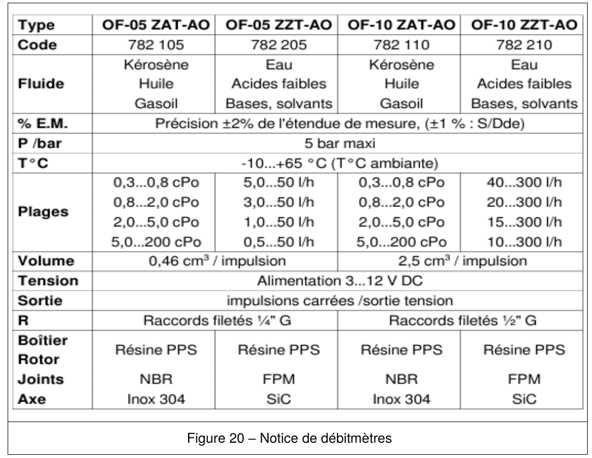

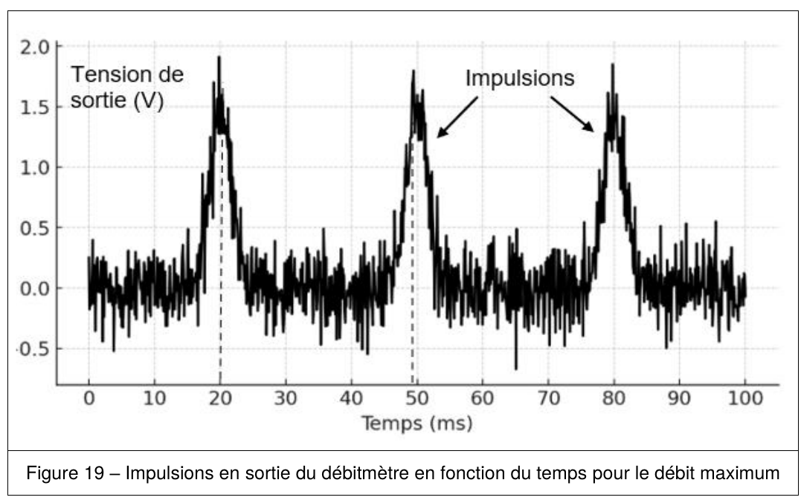

| Type | OF-05 ZAT-AO | OF-05 ZZT-AO | OF-10 ZAT-AO | OF-10 ZZT-AO |
|---|---|---|---|---|
| Fluide | Kérosène, Huile, Gasoil | Eau, Acides faibles, Bases, solvants | Kérosène, Huile, Gasoil | Eau, Acides faibles, Bases, solvants |
| Plages | 0,3 à 200 cPo selon plage | 0,5 à 50 L/h selon plage | 0,3 à 200 cPo selon plage | 10 à 300 L/h selon plage |
| Volume | 0,46 cm³/impulsion | 0,46 cm³/impulsion | 2,5 cm³/impulsion | 2,5 cm³/impulsion |
| Tension | Alimentation 3...12 V DC | | | |
| Sortie | Impulsions carrées / sortie tension | | | |

Q44. Déterminer la durée entre deux impulsions, notée ΔT_min, à la sortie du débitmètre (figure 19).
Q45. Calculer le nombre d'impulsions en une heure, noté N_I1, dans le cas où le temps entre deux impulsions correspond à ΔT_min.
Q46. Calculer, en utilisant le résultat de Q45, le débit maximum que peut mesurer le débitmètre OF-10 ZZT, noté D_max, exprimé en cm³ par heure.
Q47. Calculer le nombre d'impulsions, noté N_I2, nécessaires en sortie du débitmètre OF-10 ZZT afin de remplir un verre de 0,25 L (250 cm³).

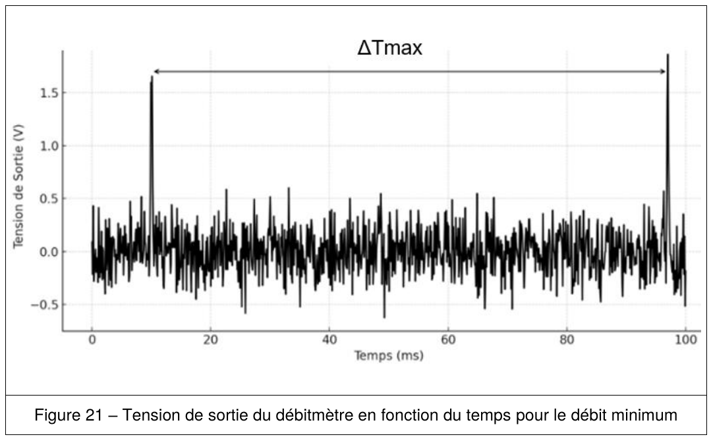

Q48. Calculer le temps maximal, noté T_MAX, nécessaire pour remplir un verre de 0,25 L si le temps entre deux impulsions correspond à ΔT_MAX.
Q49. Commenter la validité du débitmètre OF-10 ZZT d'après les deux critères à vérifier.

#### Partie 4 – Détection des fûts de boisson vides

Le capteur de force (4 jauges de contraintes en pont de Wheatstone) mesure la masse du fût. Une alerte doit se déclencher pour une masse de 6,8 kg (2 L restants), soit ΔU_alerte = 6,8 mV. Le montage : E = 5,0 V ; R₁ = R₃ = R₀ − ΔR ; R₂ = R₄ = R₀ + ΔR. La chaîne de mesure est : pont de Wheatstone → amplificateur ×130 → CAN (résolution 24 bits, U_PE = 5,00 V). La relation ΔU = 10⁻³ × Δm relie la variation de tension (V) à la variation de masse (kg).

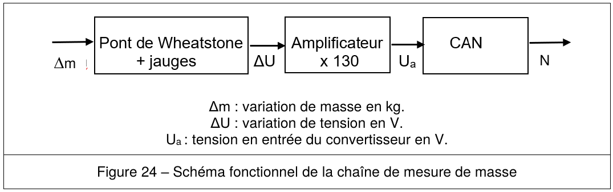

Q50. Exprimer la tension U₁ en fonction de R₁, R₂ et E.
Q51. Exprimer ΔU, grâce à la loi des mailles, en fonction de U₁ et U₄.
Q52. Calculer le quantum q du convertisseur analogique-numérique.
Q53. Calculer la tension U_a,alerte correspondant à ΔU_alerte.
Q54. En déduire la valeur numérique décimale N_alerte en sortie du CAN correspondant à cette alerte.
Q55. Calculer la résolution analogique de la chaîne de mesure (sachant qu'elle doit être de 2 kg), et conclure si la résolution de 24 bits est suffisante et judicieuse.

#### Partie 5 – Caractérisation du protocole de communication NFC

La communication NFC (standard ISO/IEC 14443 type A) se fait à f_p = 13,56 MHz, modulation d'amplitude, débit théorique 106 kbits/s, codage de Miller modifié.

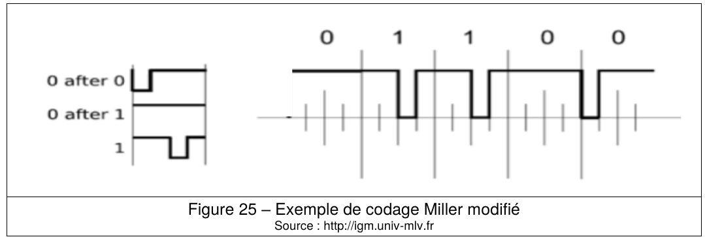

Q56. Déterminer, à l'aide de l'oscillogramme, la durée d'un bit T_B.
Q57. Calculer le débit de cette transmission binaire D, exprimé en kbits/s.
Q58. Écrire, après décodage (Miller modifié), l'octet transmis sous la forme {b₇,b₆,b₅,b₄,b₃,b₂,b₁,b₀} (b₀ = bit de poids faible, premier bit lu = '0').

| b7 | b6 | b5 | b4 | b3 | b2 | b1 | Signification |
|---|---|---|---|---|---|---|---|
| 0 | 1 | 0 | 0 | 1 | 1 | 0 | '26' = REQA (commande d'initialisation) |
| 1 | 0 | 1 | 0 | 0 | 1 | 0 | '52' = WUPA (réveil d'un tag) |
| 0 | 1 | 1 | 0 | 1 | 0 | 1 | '35' = Optional timeslot method |
| 1 | 0 | 0 | X | X | X | X | '40' à '4F' = Proprietary |
| 1 | 1 | 1 | 1 | X | X | X | '78' à '7F' = Proprietary |

Q59. En déduire le nom de la commande transmise au tag.

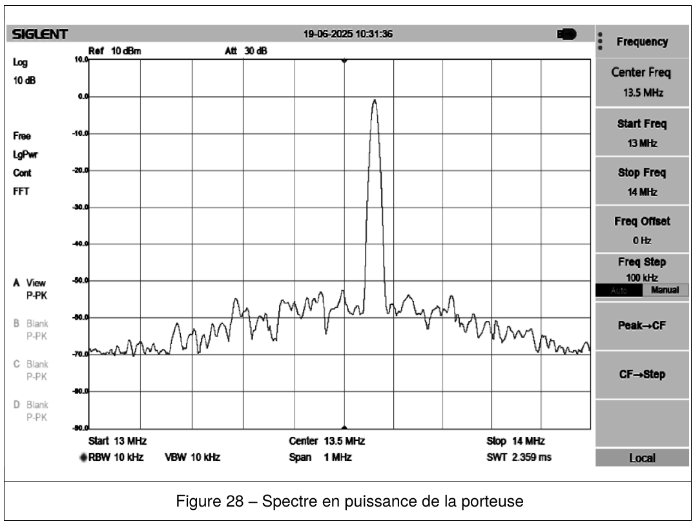

Q60. Mesurer la fréquence de la porteuse f_porteuse à l'aide du spectre.
Q61. Conclure sur la validité des caractéristiques de fréquence et de débit binaire de la communication NFC.

#### Partie 6 – Choix des antennes

Étude de la transmission Wi-Fi 5 GHz en espace libre entre les terminaux et deux points d'accès (AP1, AP2, Cisco Aironet 3702e), distance maximale mesurée : 65,0 m. Fréquences : f_Wi-Fi1 = 5,50 GHz (AP1), f_Wi-Fi2 = 5,54 GHz (AP2).

Bilan de liaison : **Pr = Pe + Ge + Gr − FSL**, avec FSL (formule de Friis) : **FSL = −147,5 + 20×log(f) + 20×log(d)** (f en Hz, d en m).

Q62. Montrer que les pertes en espace libre FSL, pour d = 65 m et f_Wi-Fi2 = 5,54 GHz, valent environ 84 dB.

Données terminal → AP : P_TER = 13 dBm ; G_TER = 0 dBi ; FSL = 84 dB ; G_APMIN2 = 6,0 dBi ; P_APMIN = −65 dBm.
Données AP → terminal : P_AP = 23 dBm ; FSL = 84 dB ; G_TER = 0 dBi ; sensibilité terminal S_TER = −67 dBm ; marge souhaitée 10 dB.

Q63. Calculer la puissance minimale P_TERmin que peut recevoir le terminal pour que la communication soit établie.
Q64. Calculer le gain minimum de l'antenne de l'AP, noté G_APMIN1, pour la transmission AP → terminal.

À 5,54 GHz, la réglementation française limite la PIRE à 30 dBm ; la puissance d'émission vers l'antenne de l'AP est de 23 dBm.

Q65. Calculer le gain maximum de l'antenne de l'AP, noté G_APMAX, pour respecter la réglementation.

| Antenne | Gain (dBi) | Angle d'ouverture à −3 dB | Bande passante (MHz) | Impédance (Ω) |
|---|---|---|---|---|
| AIR-ANT 2547-VN | 7 | 360° | 5150-5875 | 50 |
| AIR-ANT 2466-PR | 6 | 75° | 2400-2484 | 50 |
| AIR-ANT 2568-VG | 8 | 360° | 5150-5925 | 50 |
| AIR-ANT 2588-P3M | 8 | 120° | 5150-5900 | 50 |
| AIR-ANT 5170-PR | 7 | 70° | 5150-5850 | 50 |
| AIR-ANT 5114-P2M | 14 | 30° | 5150-5900 | 50 |

Q66. Déterminer, en le(s) justifiant, le(s) choix d'antenne(s) pour AP1 puis pour AP2, respectant les critères de gain, de fréquence et d'angle d'ouverture.

---

### Annale — Session 2025 (officielle), domaine de la physique (1h30, 3 parties indépendantes)

**Contexte :** un système de gestion de parking utilise une boucle magnétique pour détecter les véhicules à l'entrée, un bus RS485 pour piloter des panneaux d'affichage de places, et des capteurs LoRaWAN pour localiser les places vides.

#### Partie 3 – Dimensionnement du détecteur de véhicule

Une boucle magnétique (bobine d'inductance L, N spires) détecte le passage d'un véhicule par variation de fréquence du signal généré (f₀ à vide, f₁ au passage d'un véhicule). Dimensions de la boucle : rectangle 4,3 m × 1,5 m.

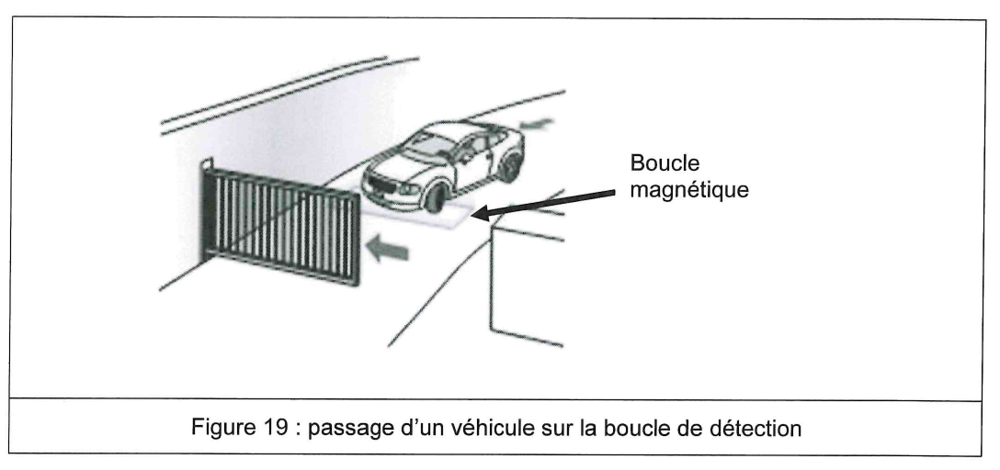

Q46. Calculer le périmètre U de la boucle.

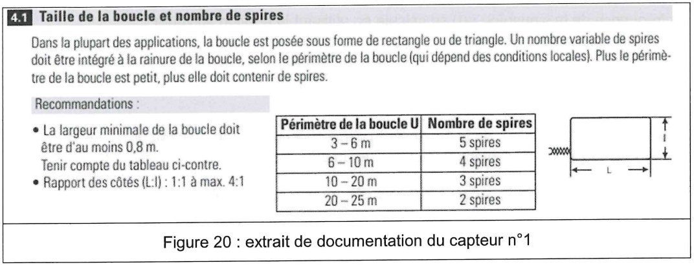

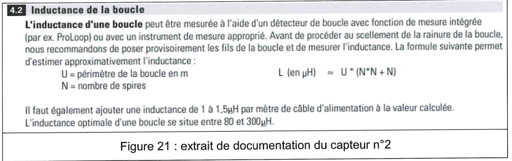

Q47. Déterminer le nombre de spires N de la boucle d'après le tableau ci-dessus.

Formule d'estimation de l'inductance : **L (µH) ≈ U × (N×N + N)**, avec U le périmètre en m. Longueur du câble d'alimentation négligée. Plage optimale d'inductance : 80 à 300 µH.

Q48. Calculer la valeur L₀ de l'inductance à vide.

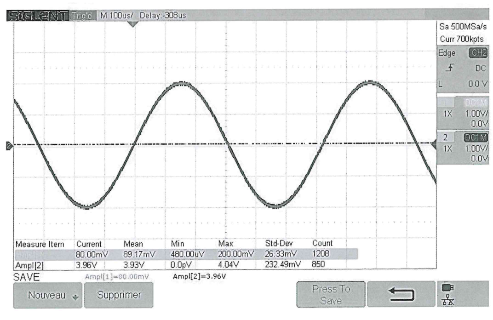

Q49. Indiquer, en justifiant, si la tension u(t) est périodique.
Q50. Déterminer la période T₀ de u(t) en la faisant apparaître sur le document réponse.
Q51. En déduire la fréquence f₀ de u(t).

Fréquence de la sinusoïde : **f = 1/(2π√(LC))**, avec C = 70 µF (capacité interne du capteur). Un véhicule se présente : la fréquence générée vaut alors 1,2 kHz.

Q52. Calculer la valeur L₁ de l'inductance de la boucle au passage du véhicule.
Q53. Vérifier si L₀ et L₁ sont dans la plage optimale (80-300 µH).

#### Partie 4 – Dépannage de la liaison RS485

Un défaut d'affichage est observé sur les panneaux reliés par bus RS485 (9600 bauds ± 5 %) à une SEVEN BOX. Deux hypothèses : (1) erreur de configuration du débit binaire, (2) défaut sur la ligne de transmission. Vitesse des ondes dans la ligne : 2,0×10⁸ m/s.

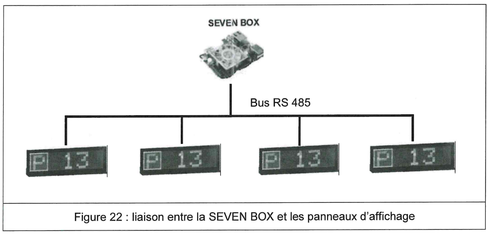

Q54. Indiquer, en justifiant, si la ligne RS485 est différentielle.
Q55. Justifier qu'une seule voie de l'oscilloscope ne suffit pas pour visualiser le signal U_RS485.
Q56. Donner l'opération mathématique réalisée par l'oscilloscope pour obtenir le signal « M ».
Q57. Déterminer le nombre de bits total de la trame, noté N_t (avec bit de start et bit de stop par octet).
Q58. Mesurer le débit binaire de cette trame, noté D.
Q59. Conclure sur la validité de l'hypothèse n°1 (erreur de débit).

Q60. Déterminer, en justifiant, si le défaut est un « circuit ouvert » ou un « court-circuit ».
Q61. Indiquer si ce défaut peut expliquer le problème d'affichage.
Q62. Mesurer la durée Δt associée au retard de l'onde réfléchie par rapport à l'onde incidente.
Q63. Calculer la distance d entre l'entrée de la ligne et le défaut.

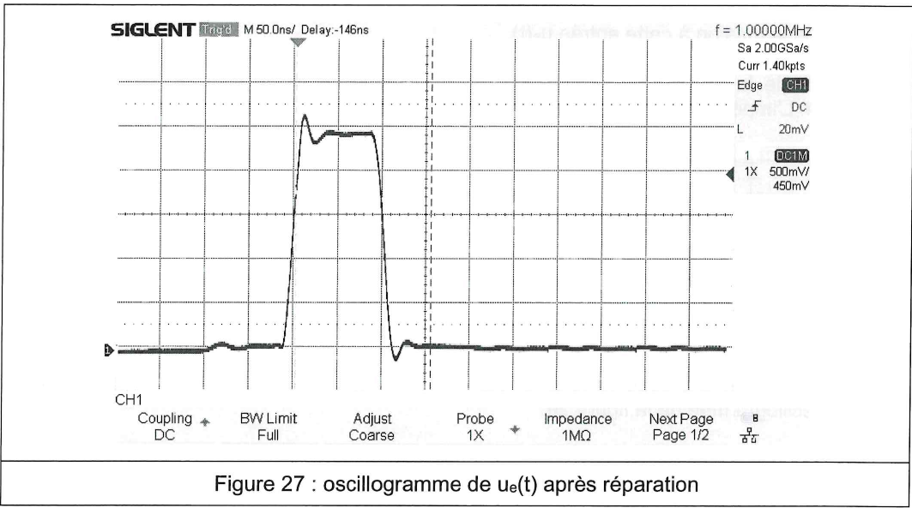

Q64. Conclure sur la qualité de la réparation.

#### Partie 5 – Amélioration du système de localisation des places vides grâce aux capteurs LoRa

Un capteur de présence LW009-SM (LoRaWAN) est étudié pour équiper des places de parking sur deux niveaux (−1 et −2), la passerelle étant au niveau −1. Distance maximale capteur-passerelle : 100 m.

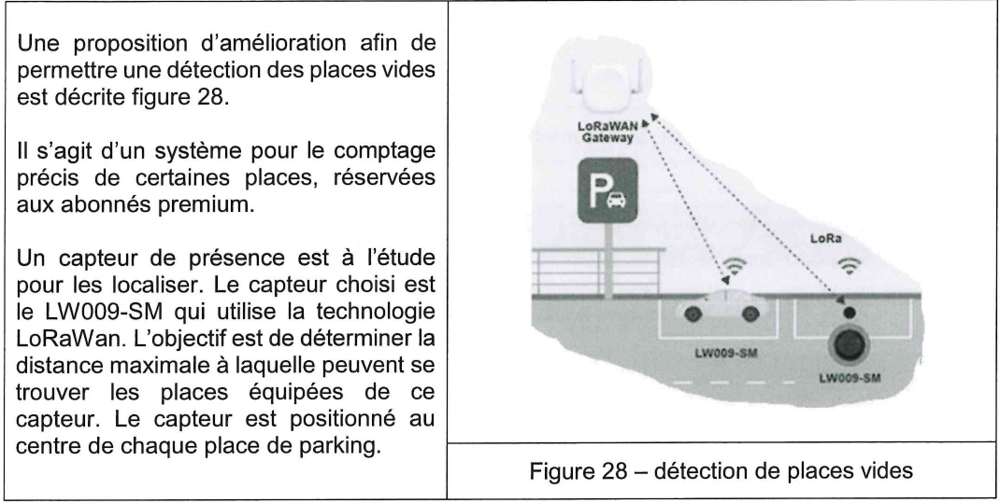

| Paramètre | Valeur |
|---|---|
| Protocole LoRa | LoRaWAN V1.0.3 Class A |
| Fréquence LoRa | EU868/AS923 |
| Spreading Factor | 125 kHz à 500 kHz |
| Tx Power | Max 17 dBm |
| Sensibilité capteur | −135 dBm (SF12, 125 kHz) |

| Passerelle IXM-LPWA-800-16-K9 | Valeur |
|---|---|
| Bande de fréquence | 863-870 MHz |
| Sensibilité de réception | jusqu'à −139,5 dBm |

| Antenne de la passerelle ANT-LPWA-DB-O-N-5 | Valeur |
|---|---|
| Type | Omnidirectionnelle |
| Bande de fréquence | 863-928 MHz |
| Gain | 5 dBi |
| Impédance | 50 Ω |

Q65. Compléter le tableau (fréquence d'émission en Europe, sensibilité de réception de la passerelle, puissance maximale d'émission du capteur = PIRE, gain de l'antenne de réception).

Bilan de liaison en espace libre : **Pr = PIRE − FSL + Gr**, avec **FSL = 32,45 + 20×log(f) + 20×log(d)** (f en MHz, d en km).

Q66. Montrer que les pertes en espace libre FSL, pour les places les plus éloignées du niveau −1 (d = 100 m), valent environ 71 dB.
Q67. Calculer le niveau de puissance reçue par la passerelle, noté Pr, exprimé en dBm.

Marge nécessaire pour un bon fonctionnement : 10 dB par rapport à la sensibilité de la passerelle.

Q68. En déduire si la communication du capteur LW009 vers la passerelle est réalisable à ce niveau.

Le niveau −2 est séparé de la passerelle par une dalle de béton armé, atténuant de 40 dB.

Q69. Valider, en justifiant, si toutes les places du parking peuvent être équipées de ce capteur.

